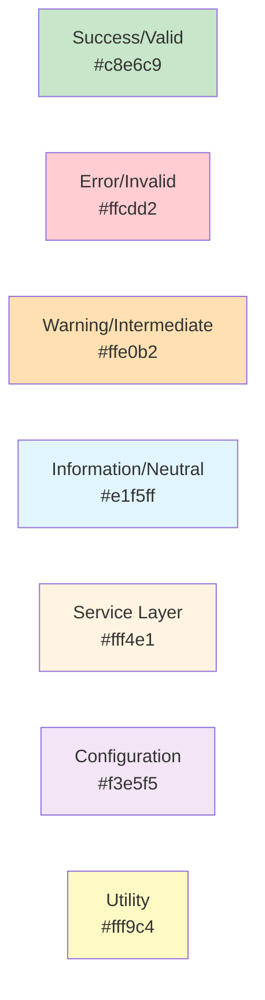

# Architecture Diagrams Index

This directory contains comprehensive visual documentation for the speakToMack project, organized by audience.

## For Developers

### [Class Dependencies](class-dependencies.md)
**Purpose:** Understand the code structure, design patterns, and dependency relationships

**Contains:**
- Core interface hierarchy (SttEngine, TranscriptReconciler, HotkeyTrigger)
- Reconciliation strategy pattern implementations
- Hotkey trigger strategy pattern implementations
- Orchestration layer composition
- Package dependency graph
- Dependency rules (allowed and forbidden)
- Design patterns by package
- Thread safety guarantees table
- Immutable value objects (records)
- Configuration binding flow

**Best for:** New developers, code reviews, refactoring planning

---

### [Thread Model & Concurrency](thread-model-concurrency.md)
**Purpose:** Master the complex threading and synchronization mechanisms

**Contains:**
- Thread pool architecture diagram
- Parallel STT execution flow (sequence diagram)
- MDC propagation across threads
- Synchronization points for each major component
- ConcurrencyGuard pattern
- Thread pool configuration
- Race condition prevention strategies
- Deadlock prevention (lock ordering hierarchy)
- Timeout management
- Memory visibility guarantees table
- Async logging thread isolation
- Key concurrency invariants

**Best for:** Debugging concurrency issues, performance optimization, understanding thread safety

---

### [Data Flow Diagram](data-flow-diagram.md)
**Purpose:** Trace how data flows through the system end-to-end

**Contains:**
- Complete transcription pipeline (sequence diagram)
- State machine: Dictation session lifecycle
- Parallel processing timeline (Gantt chart)
- Error handling flow (comprehensive flowchart)
- Audio format validation pipeline

**Best for:** Understanding the happy path, debugging runtime behavior, onboarding

---

## For Users

### [User Journey Map](user-journey.md)
**Purpose:** Visualize the user experience from installation to daily use

**Contains:**
- First-time user onboarding journey
- End-to-end timeline (installation to production)
- Decision tree: Choosing your hotkey type
- Typical daily usage flow
- User experience maturity curve (Week 1 → Month 2+)
- Common usage scenarios (email, coding, notes)
- Permission setup visual guide
- User mental model (what you see vs. what happens)
- Success metrics journey
- Time investment table
- Expected outcomes by user type
- User pain points & solutions table
- Emotional journey arc

**Best for:** First-time users, product managers, UX reviews, support training

---

### [Troubleshooting Guide](troubleshooting-guide.md)
**Purpose:** Diagnose and fix common problems with visual flowcharts

**Contains:**
- Master troubleshooting decision tree
- Problem 1: App won't start (detailed flowchart)
- Problem 2: Hotkey not working (detailed flowchart)
- Problem 3: No text appears (detailed flowchart)
- Problem 4: Wrong transcription (detailed flowchart)
- Problem 5: Slow performance (detailed flowchart)
- Quick reference table: Common fixes
- Diagnostic commands (bash scripts)
- When to seek help flowchart
- Preventive maintenance checklist

**Best for:** Self-service support, reducing support tickets, operator training

---

## High-Level Overview

### [Architecture Overview](architecture-overview.md)
**Purpose:** Get a 10,000-foot view of the system architecture

**Contains:**
- High-level component diagram
- 3-tier architecture layers
- Design patterns applied
- Key architectural characteristics table
- Links to all other diagrams

**Best for:** Stakeholders, initial project exploration, presentations

---

## Diagram Technology

All diagrams are created using **Mermaid**, which renders automatically on:
- GitHub (native support)
- GitLab (native support)
- Most modern markdown viewers
- VS Code (with Mermaid extension)

### Rendering Diagrams Locally

```bash
# Install Mermaid CLI (optional, for PNG/SVG export)
npm install -g @mermaid-js/mermaid-cli

# Render to PNG
mmdc -i architecture-overview.md -o architecture-overview.png

# Render to SVG
mmdc -i architecture-overview.md -o architecture-overview.svg
```

## Diagram Coverage Matrix

| Audience | Topic | Diagram File |
|----------|-------|--------------|
| **Developer** | Code Structure | [class-dependencies.md](class-dependencies.md) |
| **Developer** | Threading | [thread-model-concurrency.md](thread-model-concurrency.md) |
| **Developer** | Data Flow | [data-flow-diagram.md](data-flow-diagram.md) |
| **User** | Onboarding | [user-journey.md](user-journey.md) |
| **User** | Troubleshooting | [troubleshooting-guide.md](troubleshooting-guide.md) |
| **All** | Overview | [architecture-overview.md](architecture-overview.md) |

## Total Diagram Count

- **9 diagrams** in architecture-overview.md (pre-existing)
- **11 diagrams** in class-dependencies.md (new)
- **18 diagrams** in thread-model-concurrency.md (new)
- **5 diagrams** in data-flow-diagram.md (pre-existing)
- **11 diagrams** in user-journey.md (new)
- **6 diagrams** in troubleshooting-guide.md (new)

**Total: 60 diagrams** across 6 documentation files

## Recommended Reading Order

### For New Developers
1. [Architecture Overview](architecture-overview.md) - Start here
2. [Data Flow Diagram](data-flow-diagram.md) - Understand the happy path
3. [Class Dependencies](class-dependencies.md) - Dive into code structure
4. [Thread Model & Concurrency](thread-model-concurrency.md) - Master threading (advanced)

### For New Users
1. [User Journey Map](user-journey.md) - What to expect
2. [Troubleshooting Guide](troubleshooting-guide.md) - Keep handy for problems
3. [Architecture Overview](architecture-overview.md) - Optional: Understand how it works

### For Operators/SREs
1. [Architecture Overview](architecture-overview.md) - System overview
2. [Data Flow Diagram](data-flow-diagram.md) - Error flows
3. [Troubleshooting Guide](troubleshooting-guide.md) - Diagnostic procedures
4. [Thread Model & Concurrency](thread-model-concurrency.md) - Performance tuning

## Contributing New Diagrams

When adding new diagrams:

1. **Use Mermaid syntax** for consistency and GitHub compatibility
2. **Add descriptive titles** using `## Diagram Name` markdown headers
3. **Include explanatory text** before each diagram
4. **Update this README** to reference your new diagram
5. **Test rendering** on GitHub before committing
6. **Keep diagrams focused** - one concept per diagram (split if > 50 nodes)
7. **Use consistent colors**:
   - Green (#c8e6c9) for success/valid states
   - Red (#ffcdd2) for errors/invalid states
   - Yellow (#ffe0b2) for warnings/intermediate states
   - Blue (#e1f5ff) for information/neutral states

## Diagram Style Guide

### Color Palette


