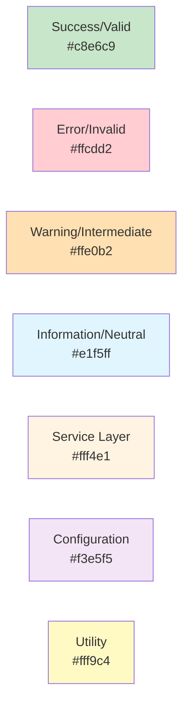

# Architecture Diagrams Index

This directory contains comprehensive visual documentation for the blckvox project, organized by audience.

## For Developers

### [Class Dependencies](class-dependencies.md)
**Purpose:** Understand the code structure, design patterns, and dependency relationships

**Contains:**
- Core interface hierarchy (SttEngine, TranscriptReconciler, HotkeyTrigger)
- Reconciliation strategy pattern implementations
- Hotkey trigger strategy pattern implementations
- Orchestration layer composition
- Package dependency graph
- Dependency rules (allowed and forbidden)
- Design patterns by package
- Thread safety guarantees table
- Immutable value objects (records)
- Configuration binding flow

**Best for:** New developers, code reviews, refactoring planning

---

### [Thread Model & Concurrency](thread-model-concurrency.md)
**Purpose:** Master the complex threading and synchronization mechanisms

**Contains:**
- Thread pool architecture diagram
- Parallel STT execution flow (sequence diagram)
- MDC propagation across threads
- Synchronization points for each major component
- ConcurrencyGuard pattern
- Thread pool configuration
- Race condition prevention strategies
- Deadlock prevention (lock ordering hierarchy)
- Timeout management
- Memory visibility guarantees table
- Async logging thread isolation
- Key concurrency invariants

**Best for:** Debugging concurrency issues, performance optimization, understanding thread safety

---

### [Data Flow Diagram](data-flow-diagram.md)
**Purpose:** Trace how data flows through the system end-to-end

**Contains:**
- Complete transcription pipeline (sequence diagram)
- State machine: Dictation session lifecycle
- Parallel processing timeline (Gantt chart)
- Error handling flow (comprehensive flowchart)
- Audio format validation pipeline

**Best for:** Understanding the happy path, debugging runtime behavior, onboarding

---

## For Users

### [User Journey Map](user-journey.md)
**Purpose:** Visualize the user experience from installation to daily use

**Contains:**
- First-time user onboarding journey
- End-to-end timeline (installation to production)
- Decision tree: Choosing your hotkey type
- Typical daily usage flow
- User experience maturity curve (Week 1 → Month 2+)
- Common usage scenarios (email, coding, notes)
- Permission setup visual guide
- User mental model (what you see vs. what happens)
- Success metrics journey
- Time investment table
- Expected outcomes by user type
- User pain points & solutions table
- Emotional journey arc

**Best for:** First-time users, product managers, UX reviews, support training

---

### [Troubleshooting Guide](troubleshooting-guide.md)
**Purpose:** Diagnose and fix common problems with visual flowcharts

**Contains:**
- Master troubleshooting decision tree
- Problem 1: App won't start (detailed flowchart)
- Problem 2: Hotkey not working (detailed flowchart)
- Problem 3: No text appears (detailed flowchart)
- Problem 4: Wrong transcription (detailed flowchart)
- Problem 5: Slow performance (detailed flowchart)
- Quick reference table: Common fixes
- Diagnostic commands (bash scripts)
- When to seek help flowchart
- Preventive maintenance checklist

**Best for:** Self-service support, reducing support tickets, operator training

---

### [Live Caption System](live-caption-system.md)
**Purpose:** Understand the real-time waveform and streaming caption overlay

**Contains:**
- Architecture overview with event flow
- Event flow sequence diagram (full recording lifecycle)
- Component data flow (waveform path + caption path)
- Class diagram (all 8 new classes)
- State machine (window visibility + internal states)
- Thread model (Audio → Spring → JavaFX)
- Feature toggle (conditional bean loading)
- PCM sample conversion detail
- Window layout ASCII mockup

**Best for:** Understanding the live feedback system, debugging event flow, extending the UI

---

### [Event Flow & Listener Map](event-flow-map.md)
**Purpose:** Trace every Spring ApplicationEvent through its publishers and listeners

**Contains:**
- Complete event wiring map (all 14 event types)
- Happy path event chain (hotkey → transcription → typing)
- Error path event chains (engine failure, capture error, typing fallback)
- Event payload reference table
- Live caption event sub-flow

**Best for:** Debugging event chains, understanding publisher/listener relationships, adding new events

---

### [Bean Configuration Graph](bean-configuration-graph.md)
**Purpose:** Visualize how Spring beans are wired and configured

**Contains:**
- Bean factory graph (all config classes and their beans)
- Conditional bean branching
- Component scan vs explicit bean registration table
- Dependency injection graph

**Best for:** Understanding Spring wiring, debugging bean loading, configuration changes

---

### [Feature Toggle Matrix](feature-toggle-matrix.md)
**Purpose:** Map all feature toggles and their behavioral effects

**Contains:**
- Feature toggle decision flowchart
- Configuration scenarios table (5 profiles)
- Toggle dependency graph
- Runtime behavior matrix
- Secondary toggles reference

**Best for:** Configuration planning, understanding feature interdependencies, testing profiles

---

### [Startup & Shutdown Lifecycle](startup-lifecycle.md)
**Purpose:** Understand application initialization and teardown ordering

**Contains:**
- Full startup sequence diagram
- Startup validation chain
- SmartLifecycle phase ordering
- Shutdown sequence
- Fail-fast decision tree

**Best for:** Debugging startup failures, understanding initialization order, lifecycle management

---

### [Exception Flow & Recovery](exception-flow.md)
**Purpose:** Map every exception type through its throw, catch, and recovery paths

**Contains:**
- Exception hierarchy tree
- Throw & catch map
- Engine failure recovery sequence (watchdog)
- Typing fallback cascade
- Capture error flows
- Invalid state transition recovery
- Error recovery summary table

**Best for:** Error handling, debugging failures, understanding recovery mechanisms

---

### [Async Threading Model](async-threading-model.md)
**Purpose:** Deep dive into thread handoffs, pool configuration, and MDC propagation

**Contains:**
- Thread architecture overview (7 thread types, all handoff mechanisms)
- @Async vs sync listener classification
- Thread pool configuration diagrams
- MDC propagation flow (capture → restore → cleanup)
- Rejection policy scenarios (CallerRunsPolicy vs DiscardOldestPolicy)
- Complete dictation threading sequence (8 participants, 6 phases)

**Best for:** Performance tuning, debugging threading issues, understanding async behavior

---

### [Conditional Bean Loading](conditional-bean-loading.md)
**Purpose:** Visualize how @ConditionalOnProperty controls bean instantiation

**Contains:**
- Conditional bean loading flowchart (all 10 conditional beans)
- Bean presence matrix across 5 configuration profiles
- Optional injection pattern (SystemTrayManager, OrchestrationConfig)
- Live caption bean cluster
- Reconciliation bean branching (mutual exclusivity)
- Default vs minimal runtime comparison

**Best for:** Understanding feature flags, configuration profiles, optional dependency injection

---

## High-Level Overview

### [Architecture Overview](architecture-overview.md)
**Purpose:** Get a 10,000-foot view of the system architecture

**Contains:**
- High-level component diagram
- 3-tier architecture layers
- Design patterns applied
- Key architectural characteristics table
- Links to all other diagrams

**Best for:** Stakeholders, initial project exploration, presentations

---

## Diagram Technology

All diagrams are created using **Mermaid**, which renders automatically on:
- GitHub (native support)
- GitLab (native support)
- Most modern markdown viewers
- VS Code (with Mermaid extension)

### Rendering Diagrams Locally

```bash
# Install Mermaid CLI (optional, for PNG/SVG export)
npm install -g @mermaid-js/mermaid-cli

# Render to PNG
mmdc -i architecture-overview.md -o architecture-overview.png

# Render to SVG
mmdc -i architecture-overview.md -o architecture-overview.svg
```

## Diagram Coverage Matrix

| Audience | Topic | Diagram File |
|----------|-------|--------------|
| **Developer** | Code Structure | [class-dependencies.md](class-dependencies.md) |
| **Developer** | Threading | [thread-model-concurrency.md](thread-model-concurrency.md) |
| **Developer** | Data Flow | [data-flow-diagram.md](data-flow-diagram.md) |
| **Developer** | Live Caption | [live-caption-system.md](live-caption-system.md) |
| **Developer** | Event Flow | [event-flow-map.md](event-flow-map.md) |
| **Developer** | Bean Wiring | [bean-configuration-graph.md](bean-configuration-graph.md) |
| **Developer** | Feature Toggles | [feature-toggle-matrix.md](feature-toggle-matrix.md) |
| **Developer** | Startup/Shutdown | [startup-lifecycle.md](startup-lifecycle.md) |
| **Developer** | Error Handling | [exception-flow.md](exception-flow.md) |
| **Developer** | Async Threading | [async-threading-model.md](async-threading-model.md) |
| **Developer** | Conditional Beans | [conditional-bean-loading.md](conditional-bean-loading.md) |
| **User** | Onboarding | [user-journey.md](user-journey.md) |
| **User** | Troubleshooting | [troubleshooting-guide.md](troubleshooting-guide.md) |
| **All** | Overview | [architecture-overview.md](architecture-overview.md) |

## Total Diagram Count

- **10 diagrams** in architecture-overview.md
- **12 diagrams** in class-dependencies.md
- **20 diagrams** in thread-model-concurrency.md
- **6 diagrams** in data-flow-diagram.md
- **12 diagrams** in user-journey.md
- **6 diagrams** in troubleshooting-guide.md
- **8 diagrams** in live-caption-system.md
- **5 diagrams** in event-flow-map.md
- **4 diagrams** in bean-configuration-graph.md
- **5 diagrams** in feature-toggle-matrix.md
- **5 diagrams** in startup-lifecycle.md
- **7 diagrams** in exception-flow.md
- **6 diagrams** in async-threading-model.md
- **6 diagrams** in conditional-bean-loading.md

**Total: ~112 diagrams** across 14 documentation files

## Recommended Reading Order

### For New Developers
1. [Architecture Overview](architecture-overview.md) - Start here
2. [Event Flow & Listener Map](event-flow-map.md) - Understand event-driven wiring
3. [Data Flow Diagram](data-flow-diagram.md) - Understand the happy path
4. [Class Dependencies](class-dependencies.md) - Dive into code structure
5. [Bean Configuration Graph](bean-configuration-graph.md) - Spring wiring
6. [Feature Toggle Matrix](feature-toggle-matrix.md) - Configuration profiles
7. [Startup & Shutdown Lifecycle](startup-lifecycle.md) - Initialization order
8. [Live Caption System](live-caption-system.md) - Real-time UI overlay
9. [Exception Flow & Recovery](exception-flow.md) - Error handling paths
10. [Async Threading Model](async-threading-model.md) - Deep threading dive
11. [Conditional Bean Loading](conditional-bean-loading.md) - Feature flag beans
12. [Thread Model & Concurrency](thread-model-concurrency.md) - Master threading (advanced)

### For New Users
1. [User Journey Map](user-journey.md) - What to expect
2. [Troubleshooting Guide](troubleshooting-guide.md) - Keep handy for problems
3. [Architecture Overview](architecture-overview.md) - Optional: Understand how it works

### For Operators/SREs
1. [Architecture Overview](architecture-overview.md) - System overview
2. [Data Flow Diagram](data-flow-diagram.md) - Error flows
3. [Troubleshooting Guide](troubleshooting-guide.md) - Diagnostic procedures
4. [Thread Model & Concurrency](thread-model-concurrency.md) - Performance tuning

## Contributing New Diagrams

When adding new diagrams:

1. **Use Mermaid syntax** for consistency and GitHub compatibility
2. **Add descriptive titles** using `## Diagram Name` markdown headers
3. **Include explanatory text** before each diagram
4. **Update this README** to reference your new diagram
5. **Test rendering** on GitHub before committing
6. **Keep diagrams focused** - one concept per diagram (split if > 50 nodes)
7. **Use consistent colors**:
   - Green (#c8e6c9) for success/valid states
   - Red (#ffcdd2) for errors/invalid states
   - Yellow (#ffe0b2) for warnings/intermediate states
   - Blue (#e1f5ff) for information/neutral states

## Diagram Style Guide

### Color Palette


```mermaid
graph LR
    Success[Success/Valid<br/>#c8e6c9]
    Error[Error/Invalid<br/>#ffcdd2]
    Warning[Warning/Intermediate<br/>#ffe0b2]
    Info[Information/Neutral<br/>#e1f5ff]
    Service[Service Layer<br/>#fff4e1]
    Config[Configuration<br/>#f3e5f5]
    Util[Utility<br/>#fff9c4]

    style Success fill:#c8e6c9
    style Error fill:#ffcdd2
    style Warning fill:#ffe0b2
    style Info fill:#e1f5ff
    style Service fill:#fff4e1
    style Config fill:#f3e5f5
    style Util fill:#fff9c4
```
