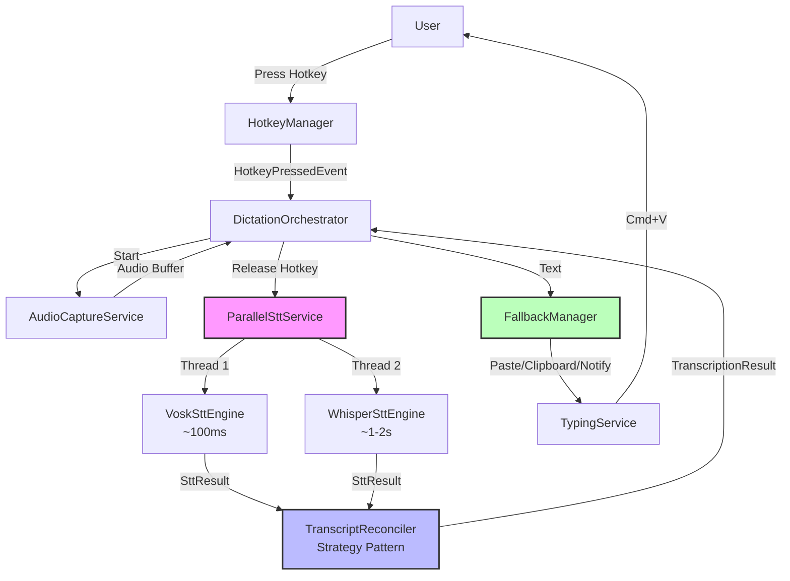
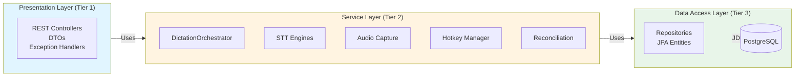
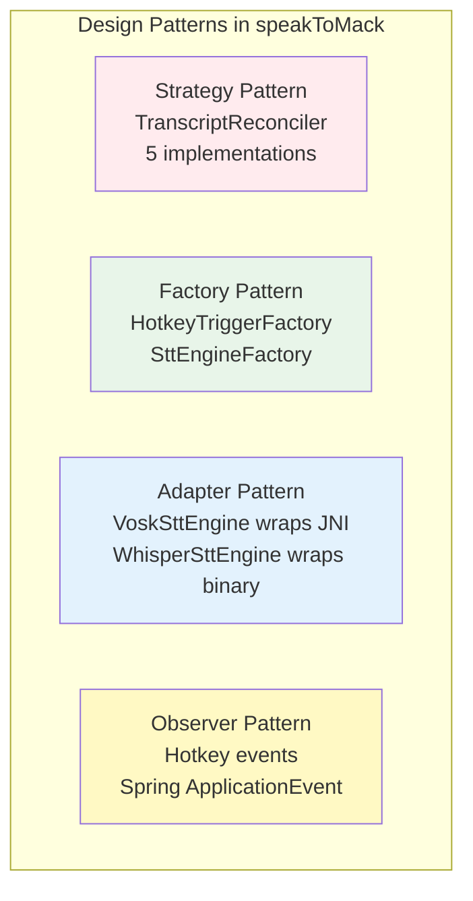

# speakToMack Architecture Overview

## High-Level Component Diagram

## 3-Tier Architecture Layers

## Design Patterns Applied

## Key Architectural Characteristics

| Characteristic | Priority | Implementation |
|----------------|----------|----------------|
| **Privacy** | Critical | 100% local processing, no cloud APIs |
| **Resilience** | Critical | Dual-engine fallback, 3-tier typing fallback |
| **Performance** | High | Parallel execution (latency = max, not sum) |
| **Extensibility** | High | Strategy pattern for reconciliation/hotkeys |
| **Observability** | High | Log4j 2 with MDC, Prometheus metrics |
| **Maintainability** | High | Clean Code principles, Checkstyle enforcement |
