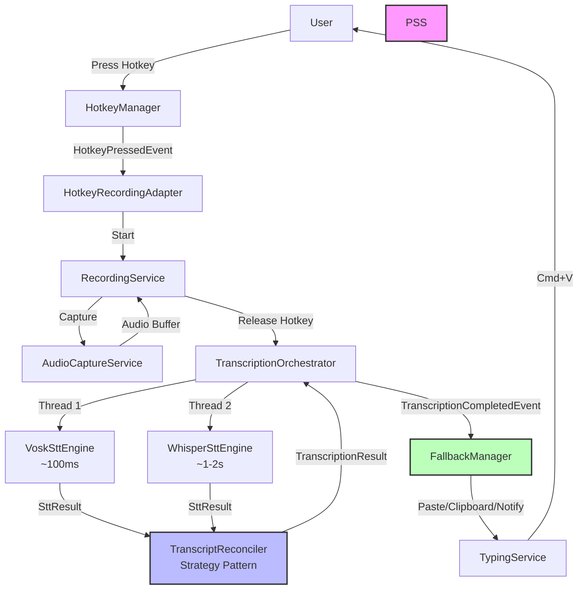
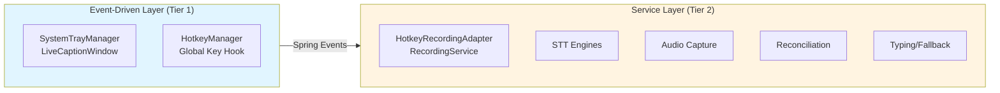
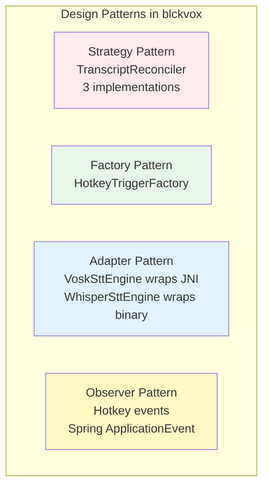
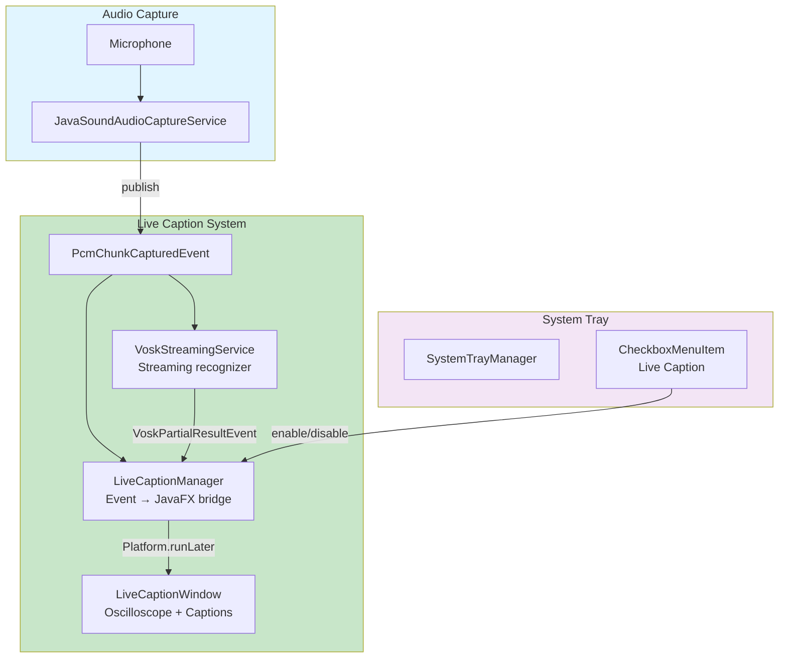

# blckvox Architecture Overview

## High-Level Component Diagram

```mermaid
graph TB
    User[User] -->|Press Hotkey| HM[HotkeyManager]
    HM -->|HotkeyPressedEvent| Adapter[HotkeyRecordingAdapter]
    Adapter -->|Start| RS[RecordingService]
    RS -->|Capture| AC[AudioCaptureService]
    AC -->|Audio Buffer| RS
    RS -->|Release Hotkey| TO[TranscriptionOrchestrator]
    
    TO -->|Thread 1| Vosk[VoskSttEngine<br/>~100ms]
    TO -->|Thread 2| Whisper[WhisperSttEngine<br/>~1-2s]

    Vosk -->|SttResult| Rec[TranscriptReconciler<br/>Strategy Pattern]
    Whisper -->|SttResult| Rec

    Rec -->|TranscriptionResult| TO
    TO -->|TranscriptionCompletedEvent| FM[FallbackManager]
    FM -->|Paste/Clipboard/Notify| TS[TypingService]
    TS -->|Cmd+V| User
    
    style PSS fill:#f9f,stroke:#333,stroke-width:2px
    style Rec fill:#bbf,stroke:#333,stroke-width:2px
    style FM fill:#bfb,stroke:#333,stroke-width:2px
```

## 2-Tier Architecture Layers

```mermaid
graph LR
    subgraph EventDriven["Event-Driven Layer (Tier 1)"]
        Tray[SystemTrayManager<br/>LiveCaptionWindow]
        HotkeyMgr[HotkeyManager<br/>Global Key Hook]
    end

    subgraph Service["Service Layer (Tier 2)"]
        Orchestrator[HotkeyRecordingAdapter<br/>RecordingService]
        STT[STT Engines]
        Audio[Audio Capture]
        Reconcile[Reconciliation]
        Typing[Typing/Fallback]
    end

    EventDriven -->|Spring Events| Service

    style EventDriven fill:#e1f5ff
    style Service fill:#fff4e1
```

**Note:** No HTTP/REST layer exists (`spring.main.web-application-type=none`). The application is entirely event-driven with hotkey input and system tray UI. Database persistence is planned for Phase 6.

## Design Patterns Applied

```mermaid
graph TD
    subgraph Patterns["Design Patterns in blckvox"]
        Strategy[Strategy Pattern<br/>TranscriptReconciler<br/>3 implementations]
        Factory[Factory Pattern<br/>HotkeyTriggerFactory]
        Adapter[Adapter Pattern<br/>VoskSttEngine wraps JNI<br/>WhisperSttEngine wraps binary]
        Observer[Observer Pattern<br/>Hotkey events<br/>Spring ApplicationEvent]
    end
    
    style Strategy fill:#ffebee
    style Factory fill:#e8f5e9
    style Adapter fill:#e3f2fd
    style Observer fill:#fff9c4
```

## Live Caption Overlay

```mermaid
graph TB
    subgraph CaptureLayer["Audio Capture"]
        Mic[Microphone] --> JSACS[JavaSoundAudioCaptureService]
    end

    subgraph LiveFeedback["Live Caption System"]
        PCMEvent[PcmChunkCapturedEvent]
        VSS[VoskStreamingService<br/>Streaming recognizer]
        LCM[LiveCaptionManager<br/>Event → JavaFX bridge]
        LCW[LiveCaptionWindow<br/>Oscilloscope + Captions]
    end

    subgraph TrayLayer["System Tray"]
        STM[SystemTrayManager]
        Toggle[CheckboxMenuItem<br/>Live Caption]
    end

    JSACS -->|publish| PCMEvent
    PCMEvent --> VSS
    PCMEvent --> LCM
    VSS -->|VoskPartialResultEvent| LCM
    LCM -->|Platform.runLater| LCW
    Toggle -->|enable/disable| LCM

    style CaptureLayer fill:#e1f5ff
    style LiveFeedback fill:#c8e6c9
    style TrayLayer fill:#f3e5f5
```

The live caption overlay is conditionally loaded via `live-caption.enabled=true` and adds zero overhead when disabled. See [Live Caption System](live-caption-system.md) for detailed diagrams.

## Key Architectural Characteristics

| Characteristic | Priority | Implementation |
|----------------|----------|----------------|
| **Privacy** | Critical | 100% local processing, no cloud APIs |
| **Resilience** | Critical | Dual-engine fallback, 3-tier typing fallback |
| **Performance** | High | Parallel execution (latency = max, not sum) |
| **Extensibility** | High | Strategy pattern for reconciliation/hotkeys |
| **Observability** | High | Log4j 2 with MDC, structured logging |
| **Maintainability** | High | Clean Code principles, Checkstyle enforcement |

## Additional Architecture Diagrams

For deeper technical details, see:

### Developer Diagrams
- **[Class Dependencies](class-dependencies.md)** - UML class diagrams, package structure, design patterns, dependency rules
- **[Thread Model & Concurrency](thread-model-concurrency.md)** - Thread pools, synchronization points, lock ordering, MDC propagation
- **[Data Flow Diagram](data-flow-diagram.md)** - Sequence diagrams, state machines, error handling flows
- **[Live Caption System](live-caption-system.md)** - Oscilloscope waveform, streaming Vosk captions, JavaFX overlay architecture

### User Diagrams
- **[User Journey Map](user-journey.md)** - Onboarding timeline, decision trees, usage scenarios, emotional journey
- **[Troubleshooting Guide](troubleshooting-guide.md)** - Problem diagnosis flowcharts, common fixes, diagnostic commands
