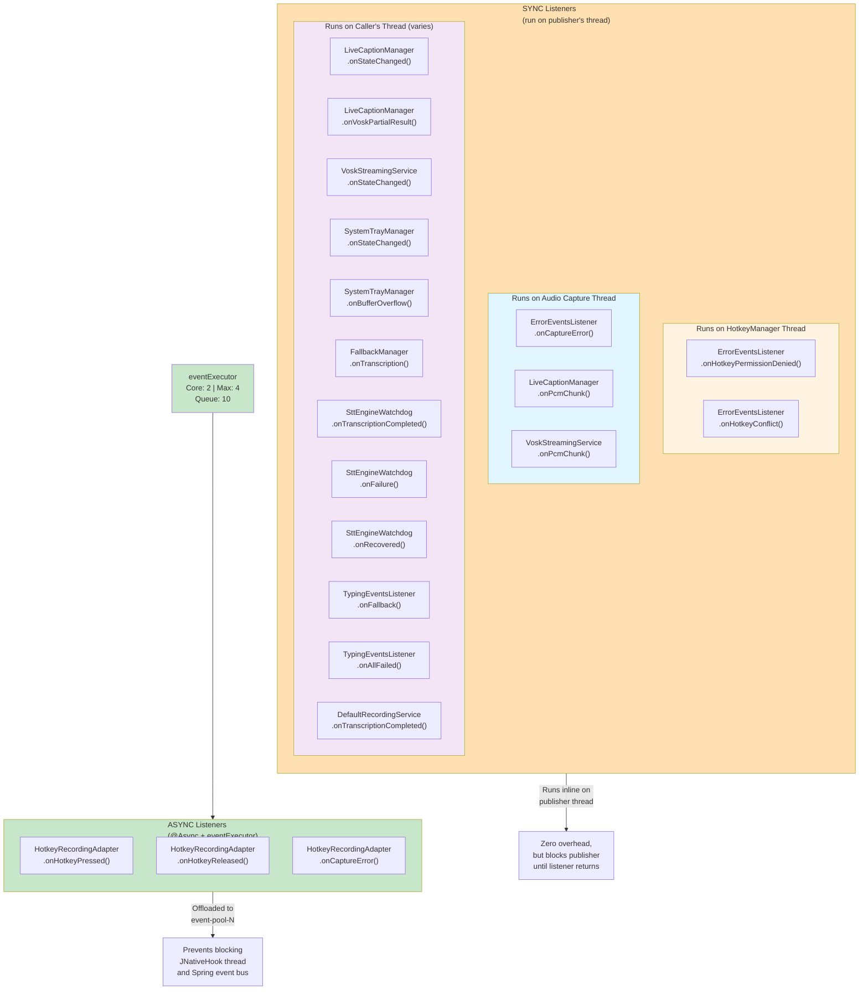
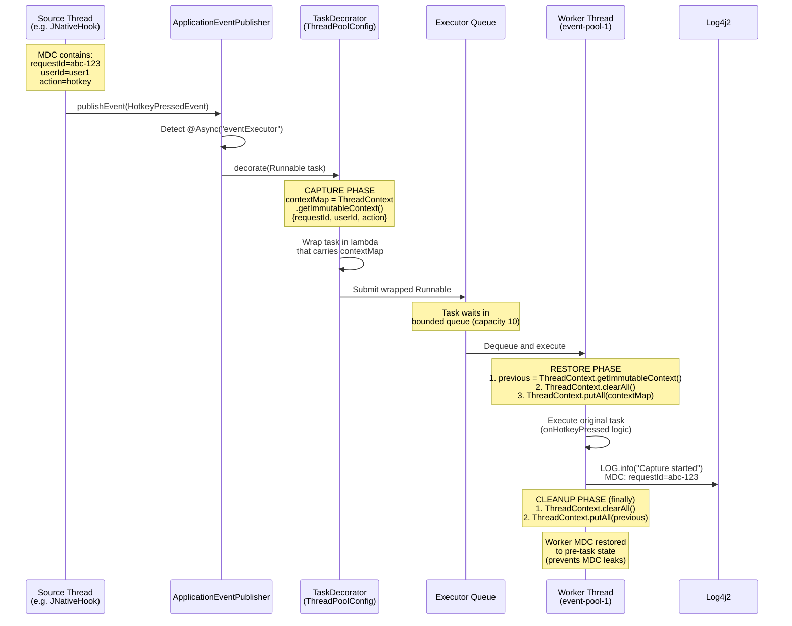
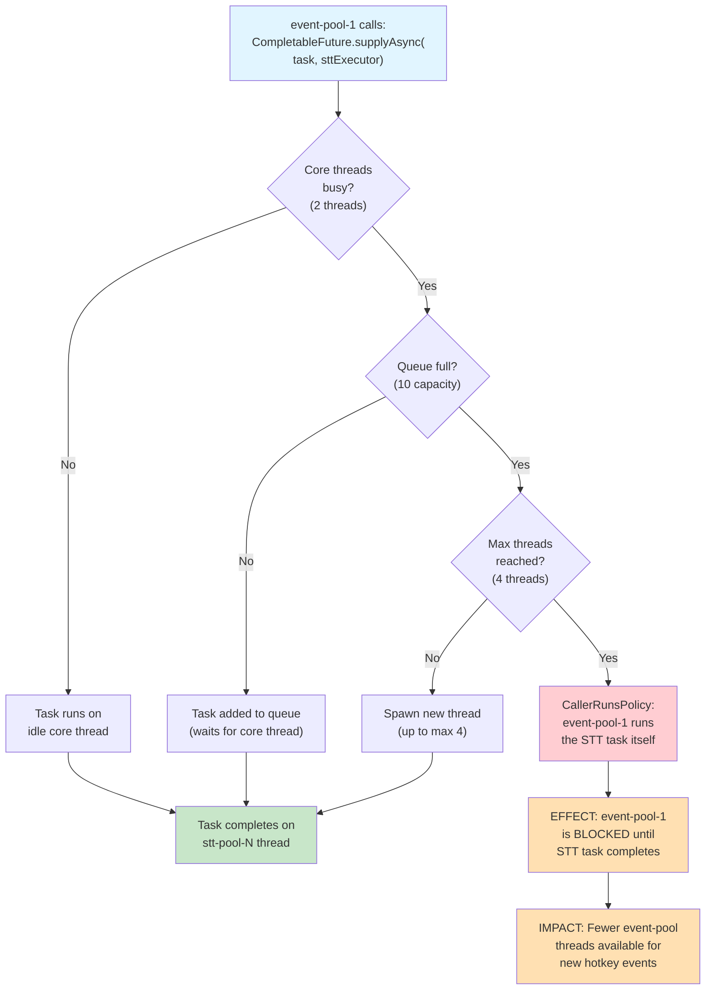
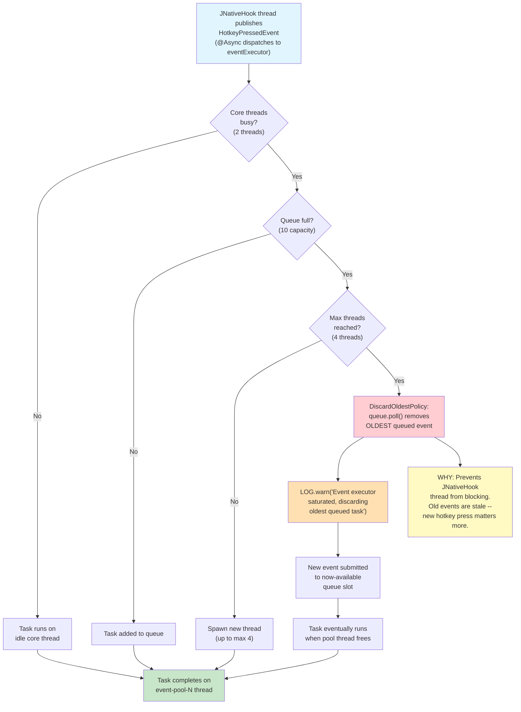
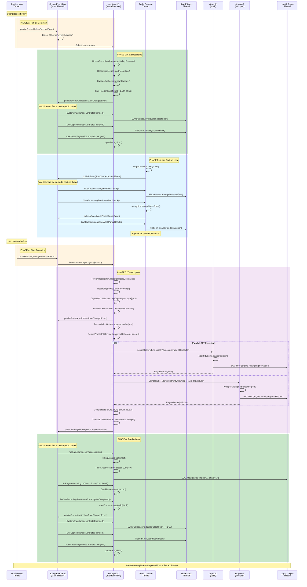

# Async Event Processing and Threading Model

Detailed documentation of the blckvox asynchronous event processing architecture,
thread pool configurations, and thread handoff patterns. Derived from verified source
code in `ThreadPoolConfig.java`, `HotkeyRecordingAdapter.java`, `DefaultParallelSttService.java`,
`LiveCaptionManager.java`, `VoskStreamingService.java`, and all event listener classes.

---

## 1. Thread Architecture Overview

All seven thread types in the application shown as swim lanes. Arrows indicate how work
moves between threads and are labeled with the specific handoff mechanism.

```mermaid
graph TB
    subgraph MainThread["Main Thread (Spring Boot)"]
        direction TB
        SpringBoot[Spring Boot Startup]
        EventPublisher["ApplicationEventPublisher<br/>(synchronous dispatch)"]
        StateTracker[ApplicationStateTracker]
    end

    subgraph JNativeHookThread["JNativeHook Thread (OS-level)"]
        direction TB
        GlobalKeyHook[NativeKeyListener]
        HotkeyPressed["publish HotkeyPressedEvent"]
        HotkeyReleased["publish HotkeyReleasedEvent"]
    end

    subgraph AudioCaptureThread["Audio Capture Thread"]
        direction TB
        TargetDataLine["TargetDataLine.read() loop"]
        PcmChunkEvent["publish PcmChunkCapturedEvent"]
        CaptureError["publish CaptureErrorEvent"]
    end

    subgraph EventPool["event-pool-N (eventExecutor)"]
        direction TB
        EP1["event-pool-1"]
        EP2["event-pool-2"]
        EP3["event-pool-3"]
        EP4["event-pool-4"]
    end

    subgraph SttPool["stt-pool-N (sttExecutor)"]
        direction TB
        SP1["stt-pool-1<br/>Vosk Engine"]
        SP2["stt-pool-2<br/>Whisper Engine"]
        SP3["stt-pool-3"]
        SP4["stt-pool-4"]
    end

    subgraph JavaFXThread["JavaFX Application Thread"]
        direction TB
        LiveCaptionWindow["LiveCaptionWindow"]
        Oscilloscope["Canvas: Waveform"]
        CaptionLabel["Label: Caption Text"]
    end

    subgraph LogThread["Log4j2 AsyncAppender Threads"]
        direction TB
        RingBuffer["LMAX Disruptor<br/>Ring Buffer"]
        AsyncWriter["AsyncAppender Thread"]
    end

    %% JNativeHook -> eventExecutor (via @Async)
    JNativeHookThread -->|"Spring Event +<br/>@Async('eventExecutor')"| EventPool

    %% Audio capture -> sync listeners (same thread)
    AudioCaptureThread -->|"Spring Event<br/>(sync on capture thread)"| EventPublisher

    %% Sync listeners on caller thread -> Platform.runLater -> JavaFX
    EventPublisher -->|"Platform.runLater()"| JavaFXThread

    %% eventExecutor -> sttExecutor (CompletableFuture.supplyAsync)
    EventPool -->|"CompletableFuture<br/>.supplyAsync(task, sttExecutor)"| SttPool

    %% sttExecutor -> back to eventExecutor (CompletableFuture.allOf.get)
    SttPool -->|"CompletableFuture<br/>.allOf().get(timeout)"| EventPool

    %% Any thread -> Log4j2
    EventPool -.->|"Log4j2 append"| LogThread
    SttPool -.->|"Log4j2 append"| LogThread
    AudioCaptureThread -.->|"Log4j2 append"| LogThread
    MainThread -.->|"Log4j2 append"| LogThread

    style MainThread fill:#e1f5ff
    style JNativeHookThread fill:#fff4e1
    style AudioCaptureThread fill:#ffe0b2
    style EventPool fill:#f3e5f5
    style SttPool fill:#c8e6c9
    style JavaFXThread fill:#c8e6c9
    style LogThread fill:#fff9c4
```

### Thread Handoff Mechanisms Summary

| Handoff | Mechanism | Blocking? |
|---------|-----------|-----------|
| JNativeHook -> eventExecutor | `@Async("eventExecutor")` on `@EventListener` | No (fire-and-forget) |
| Audio capture -> sync listeners | `ApplicationEventPublisher.publishEvent()` | Yes (runs on capture thread) |
| Sync listener -> JavaFX | `Platform.runLater(Runnable)` | No (posts to FX queue) |
| eventExecutor -> sttExecutor | `CompletableFuture.supplyAsync(task, sttExecutor)` | No (async submit) |
| sttExecutor -> eventExecutor | `CompletableFuture.allOf().get(timeoutMs)` | Yes (blocks event-pool thread until results) |
| Any thread -> Log4j2 | LMAX Disruptor ring buffer append | No (lock-free ring buffer) |

---

## 2. @Async vs Sync Listener Classification

Every `@EventListener` in the application, grouped by whether it runs asynchronously on a
thread pool or synchronously on the publisher's thread.

### Why These Three Are Async

The `HotkeyRecordingAdapter` methods are the only `@Async("eventExecutor")` listeners because:

1. **`onHotkeyPressed`** triggers `startRecording()` which starts audio capture -- must not block the JNativeHook OS key listener thread.
2. **`onHotkeyReleased`** triggers `stopRecording()` which calls `transcriptionOrchestrator.transcribe()` -- CPU-intensive work that would block the Spring event bus for seconds.
3. **`onCaptureError`** triggers `cancelRecording()` -- must not block the audio capture thread that publishes the error.

---

## 3. Thread Pool Configuration

Detailed view of both thread pools, their sizing parameters, rejection policies,
and the shared MDC-propagating TaskDecorator.

```mermaid
graph TB
    subgraph SttExecutorPool["sttExecutor (ThreadPoolTaskExecutor)"]
        direction TB
        SttBean["@Bean name = 'sttExecutor'<br/>ThreadPoolConfig.java:59"]
        SttCore["corePoolSize: 2"]
        SttMax["maxPoolSize: 4"]
        SttQueue["queueCapacity: 10"]
        SttPrefix["threadNamePrefix: 'stt-pool-'"]
        SttReject["rejectionPolicy:<br/>CallerRunsPolicy"]
        SttShutdown["waitForTasksToCompleteOnShutdown: true<br/>awaitTerminationSeconds: 30"]
    end

    subgraph EventExecutorPool["eventExecutor (ThreadPoolTaskExecutor)"]
        direction TB
        EvtBean["@Bean name = 'eventExecutor'<br/>ThreadPoolConfig.java:105"]
        EvtCore["corePoolSize: 2"]
        EvtMax["maxPoolSize: 4"]
        EvtQueue["queueCapacity: 10"]
        EvtPrefix["threadNamePrefix: 'event-pool-'"]
        EvtReject["rejectionPolicy:<br/>DiscardOldestPolicy<br/>(custom lambda)"]
        EvtShutdown["waitForTasksToCompleteOnShutdown: true<br/>awaitTerminationSeconds: 30"]
    end

    subgraph MdcDecorator["Shared TaskDecorator (MDC Propagation)"]
        direction TB
        Capture["1. Capture: ThreadContext.getImmutableContext()"]
        Restore["2. Before run: ThreadContext.clearAll() + putAll(captured)"]
        Cleanup["3. Finally: ThreadContext.clearAll() + putAll(previous)"]
    end

    subgraph Users["Pool Consumers"]
        SttUser["DefaultParallelSttService<br/>@Qualifier('sttExecutor')"]
        EvtUser["HotkeyRecordingAdapter<br/>@Async('eventExecutor')"]
    end

    SttExecutorPool --> MdcDecorator
    EventExecutorPool --> MdcDecorator

    SttUser --> SttExecutorPool
    EvtUser --> EventExecutorPool

    SttReject -->|"When pool + queue full:<br/>caller thread runs task"| BackpressureNote["Backpressure effect:<br/>event-pool-N thread blocks<br/>until stt-pool capacity frees"]
    EvtReject -->|"When pool + queue full:<br/>drop oldest queued event"| DropNote["Prevents blocking:<br/>Spring event bus never<br/>blocked by saturated pool"]

    style SttExecutorPool fill:#c8e6c9
    style EventExecutorPool fill:#f3e5f5
    style MdcDecorator fill:#fff4e1
    style Users fill:#e1f5ff
    style BackpressureNote fill:#ffe0b2
    style DropNote fill:#ffcdd2
```

### Configuration Properties

Both pools are externally configurable via `ThreadPoolProperties`:

| Property | sttExecutor | eventExecutor |
|----------|-------------|---------------|
| `threadpool.stt.core-pool-size` / `threadpool.event.core-pool-size` | 2 | 2 |
| `threadpool.stt.max-pool-size` / `threadpool.event.max-pool-size` | 4 | 4 |
| `threadpool.stt.queue-capacity` / `threadpool.event.queue-capacity` | 10 | 10 |
| `threadpool.stt.thread-name-prefix` / `threadpool.event.thread-name-prefix` | `stt-pool-` | `event-pool-` |
| Rejection Policy | `CallerRunsPolicy` | `DiscardOldestPolicy` (custom) |

---

## 4. MDC Propagation Flow

Sequence diagram showing how Log4j2 MDC (ThreadContext) flows from the event source
thread through the TaskDecorator into worker threads and is cleaned up afterward.

### MDC Fields Propagated

| Field | Source | Purpose | Log Pattern |
|-------|--------|---------|-------------|
| `requestId` | Generated per dictation session | Correlates all log lines for one dictation | Main LOG_PATTERN |
| `userId` | Application configuration | Identifies the user in multi-user scenarios | Main LOG_PATTERN |
| `action` | Event type (hotkey, capture, transcribe) | Categorizes the operation | AuditLog pattern only |
| `audioDurationMs` | Computed from PCM buffer size | Performance tracking | Not in any pattern (application-level only) |

### Why Previous Context Is Preserved

The decorator saves and restores the worker thread's existing MDC context (`previous`)
because thread pool threads are reused. Without this:

1. Task A sets `requestId=abc` on worker thread.
2. Task A completes, but `requestId=abc` leaks into the thread.
3. Task B (unrelated) runs on the same thread and logs `requestId=abc` incorrectly.

The `clearAll() + putAll(previous)` pattern in the `finally` block prevents this leak.

---

## 5. Rejection Policy Scenarios

Flowchart showing what happens when each pool reaches capacity.

### sttExecutor: CallerRunsPolicy (Blocking Backpressure)

### eventExecutor: DiscardOldestPolicy (Drop Old Events)

### Comparison: Why Different Policies?

| Concern | sttExecutor (CallerRunsPolicy) | eventExecutor (DiscardOldestPolicy) |
|---------|-------------------------------|-------------------------------------|
| **Priority** | Every STT task must complete | Recent events more important than old |
| **Caller** | event-pool thread (can afford to block) | JNativeHook thread (must never block) |
| **Data loss** | No tasks dropped | Oldest queued event dropped |
| **Backpressure** | Slows the event-pool caller | No backpressure on publisher |
| **Risk** | Event-pool thread utilization spikes | Stale hotkey events silently discarded |

---

## 6. Complete Dictation Threading

End-to-end sequence diagram for one complete dictation session, showing which thread
runs each step from hotkey press through text paste.

### Phase Summary: Thread Ownership

| Phase | Active Thread | Duration |
|-------|--------------|----------|
| 1. Hotkey Detection | JNativeHook thread | ~1ms |
| 2. Start Recording | event-pool-1 | ~10ms |
| 3. Audio Capture | Audio Capture thread (loop) | 1-30 seconds (user-controlled) |
| 4. Stop Hotkey | JNativeHook thread -> event-pool | ~1ms handoff |
| 5. Transcription | event-pool-1 (orchestration) + stt-pool-1/2 (engines) | 100ms-10s |
| 6. Text Delivery | event-pool-1 | ~50ms |

### Critical Observation: event-pool-1 Is the Workhorse

During phases 2, 5, and 6, a single `event-pool-N` thread orchestrates the entire
recording lifecycle. This is why the eventExecutor uses `DiscardOldestPolicy`: if
a second hotkey press arrives while event-pool-1 is still transcribing, the pool must
not block the JNativeHook thread. Old queued events are dropped because only the most
recent user action matters.

---

## Appendix: Thread Type Reference

| Thread | Created By | Lifecycle | Count |
|--------|-----------|-----------|-------|
| Main Thread | JVM / Spring Boot | Application lifetime | 1 |
| JNativeHook Thread | `GlobalScreen.registerNativeHook()` | Application lifetime | 1 |
| Audio Capture Thread | `JavaSoundAudioCaptureService` | Per recording session | 1 |
| stt-pool-N | `ThreadPoolTaskExecutor` (sttExecutor) | Core: always alive; max: idle timeout | 2-4 |
| event-pool-N | `ThreadPoolTaskExecutor` (eventExecutor) | Core: always alive; max: idle timeout | 2-4 |
| JavaFX Application Thread | `Platform.startup()` / JavaFX runtime | Application lifetime | 1 |
| Log4j2 AsyncAppender | LMAX Disruptor | Application lifetime | 1-2 |
