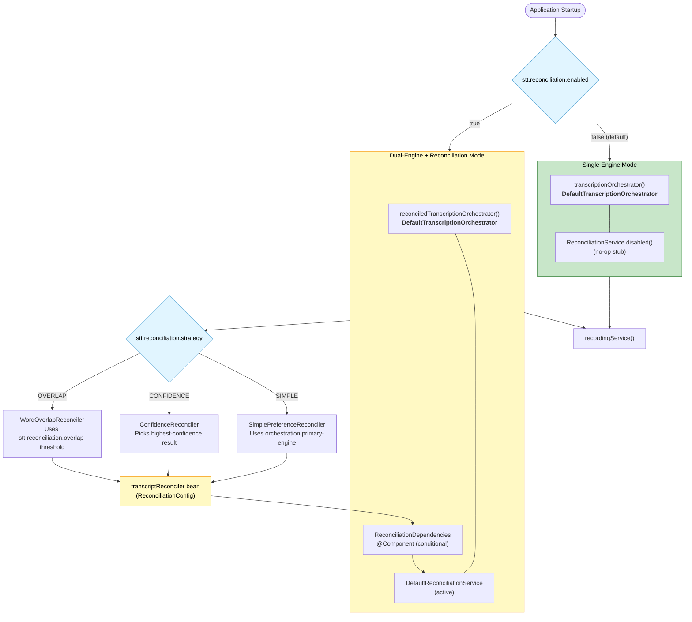
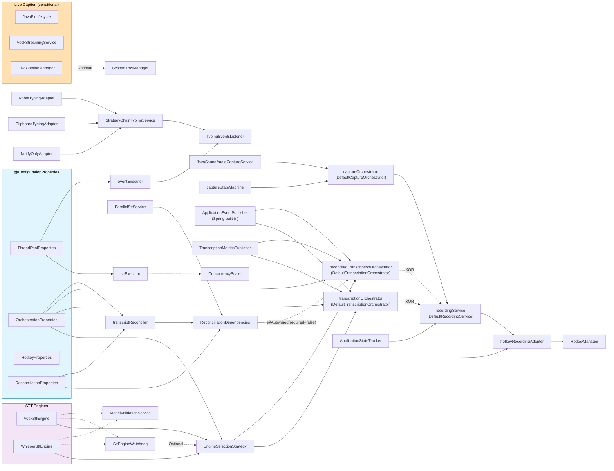

# Bean Configuration Graph

Spring bean wiring reference for the blckvox application. This document captures how
every bean is created, which `@Configuration` class owns it, what conditions gate its
creation, and how beans depend on each other via constructor injection.

All diagrams use Mermaid syntax. Render them in any Mermaid-compatible viewer (GitHub,
IntelliJ, VS Code with the Mermaid plugin, etc.).

---

## 1. Bean Factory Graph

Large flowchart showing each `@Configuration` class as a subgraph containing its
`@Bean` methods. Edges represent constructor-injection dependencies between beans.
Color coding distinguishes configuration classes from component-scanned beans and
conditional beans.

```mermaid
flowchart TB
    %% ── ThreadPoolConfig ──────────────────────────────────────────────
    subgraph ThreadPoolConfig["ThreadPoolConfig"]
        direction TB
        sttExecutor["<b>sttExecutor()</b><br/>ThreadPoolTaskExecutor<br/>core=4, max=8, queue=50<br/>prefix: stt-pool-<br/>rejection: CallerRunsPolicy<br/>MDC TaskDecorator"]
        eventExecutor["<b>eventExecutor()</b><br/>ThreadPoolTaskExecutor<br/>core=2, max=4, queue=10<br/>prefix: event-pool-<br/>rejection: DiscardOldestPolicy<br/>MDC TaskDecorator"]
    end

    %% ── OrchestrationConfig ───────────────────────────────────────────
    subgraph OrchestrationConfig["OrchestrationConfig"]
        direction TB
        captureStateMachine["<b>captureStateMachine()</b><br/>CaptureStateMachine"]
        engineSelectionStrategy["<b>engineSelectionStrategy()</b><br/>EngineSelectionStrategy"]
        captureOrchestrator["<b>captureOrchestrator()</b><br/>DefaultCaptureOrchestrator"]
        transcriptionOrchestrator["<b>transcriptionOrchestrator()</b><br/>DefaultTranscriptionOrchestrator<br/><i>single-engine mode</i>"]
        reconciledTranscriptionOrchestrator["<b>reconciledTranscriptionOrchestrator()</b><br/>DefaultTranscriptionOrchestrator<br/><i>dual-engine + reconciler</i>"]
        recordingService["<b>recordingService()</b><br/>DefaultRecordingService"]
        hotkeyRecordingAdapter["<b>hotkeyRecordingAdapter()</b><br/>HotkeyRecordingAdapter"]
    end

    %% ── ReconciliationConfig ──────────────────────────────────────────
    subgraph ReconciliationConfig["ReconciliationConfig"]
        direction TB
        transcriptReconciler["<b>transcriptReconciler()</b><br/>SimplePreferenceReconciler |<br/>ConfidenceReconciler |<br/>WordOverlapReconciler"]
    end

    %% ── Component-Scanned Beans ───────────────────────────────────────
    subgraph ComponentScan["Component-Scanned Beans"]
        direction TB
        voskSttEngine["VoskSttEngine<br/>@Component"]
        whisperSttEngine["WhisperSttEngine<br/>@Component"]
        hotkeyManager["HotkeyManager<br/>@Component / SmartLifecycle"]
        applicationStateTracker["ApplicationStateTracker<br/>@Service"]
        javaSoundAudioCaptureService["JavaSoundAudioCaptureService<br/>@Service"]
        audioValidator["AudioValidator<br/>@Component"]
        fallbackManager["FallbackManager<br/>@Component"]
        strategyChainTypingService["StrategyChainTypingService<br/>@Service"]
        robotTypingAdapter["RobotTypingAdapter<br/>@Component"]
        clipboardTypingAdapter["ClipboardTypingAdapter<br/>@Component"]
        notifyOnlyAdapter["NotifyOnlyAdapter<br/>@Component"]
        errorEventsListener["ErrorEventsListener<br/>@Component"]
        typingEventsListener["TypingEventsListener<br/>@Component"]
        transcriptionMetricsPublisher["TranscriptionMetricsPublisher<br/>@Component (no-op stub)"]
        reconciliationDependencies["ReconciliationDependencies<br/>@Component<br/><i>conditional: reconciliation.enabled=true</i>"]
    end

    %% ── Conditional Beans ─────────────────────────────────────────────
    subgraph ConditionalBeans["Conditional Beans"]
        direction TB
        systemTrayManager["SystemTrayManager<br/>@ConditionalOnProperty<br/>tray.enabled (matchIfMissing=true)"]
        liveCaptionManager["LiveCaptionManager<br/>@ConditionalOnProperty<br/>live-caption.enabled=true"]
        voskStreamingService["VoskStreamingService<br/>@ConditionalOnProperty<br/>live-caption.enabled=true"]
        javaFxLifecycle["JavaFxLifecycle<br/>@ConditionalOnProperty<br/>live-caption.enabled=true"]
        sttEngineWatchdog["SttEngineWatchdog<br/>@ConditionalOnProperty<br/>stt.watchdog.enabled=true (matchIfMissing=true)"]
        modelValidationService["ModelValidationService<br/>@ConditionalOnProperty<br/>stt.validation.enabled=true (matchIfMissing=true)"]
        concurrencyScaler["ConcurrencyScaler<br/>@ConditionalOnProperty<br/>stt.concurrency.dynamic-scaling-enabled=true"]
    end

    %% ── Injection edges ───────────────────────────────────────────────
    voskSttEngine --> engineSelectionStrategy
    whisperSttEngine --> engineSelectionStrategy
    sttEngineWatchdog -.->|Optional| engineSelectionStrategy

    javaSoundAudioCaptureService --> captureOrchestrator
    captureStateMachine --> captureOrchestrator

    engineSelectionStrategy --> transcriptionOrchestrator
    engineSelectionStrategy --> reconciledTranscriptionOrchestrator
    transcriptionMetricsPublisher --> transcriptionOrchestrator
    transcriptionMetricsPublisher --> reconciledTranscriptionOrchestrator
    reconciliationDependencies -.->|Optional| reconciledTranscriptionOrchestrator
    transcriptReconciler --> reconciliationDependencies

    captureOrchestrator --> recordingService
    transcriptionOrchestrator --> recordingService
    reconciledTranscriptionOrchestrator -.->|OR| recordingService
    applicationStateTracker --> recordingService

    recordingService --> hotkeyRecordingAdapter
    hotkeyRecordingAdapter --> hotkeyManager

    %% ── Styles ────────────────────────────────────────────────────────
    style ThreadPoolConfig fill:#bbdefb,stroke:#1565c0,color:#000
    style OrchestrationConfig fill:#c8e6c9,stroke:#2e7d32,color:#000
    style ReconciliationConfig fill:#fff9c4,stroke:#f9a825,color:#000
    style ComponentScan fill:#f3e5f5,stroke:#7b1fa2,color:#000
    style ConditionalBeans fill:#ffe0b2,stroke:#e65100,color:#000
```

---

## 2. Conditional Bean Branching

Shows the two mutually exclusive `TranscriptionOrchestrator` variants and the
`ReconciliationConfig` strategy-selection logic. Only one orchestrator bean is created
per application context, determined by the `stt.reconciliation.enabled` property.

---

## 3. Component Scan vs Explicit Beans

Beans are either auto-detected via classpath scanning (`@Component` / `@Service`) or
explicitly declared in a `@Configuration` class via `@Bean` methods. All beans are
singleton scope (Spring default) unless noted otherwise.

| Bean | Type | Registration | Config Class | Scope | Condition |
|------|------|-------------|--------------|-------|-----------|
| `sttExecutor` | `ThreadPoolTaskExecutor` | `@Bean` | `ThreadPoolConfig` | singleton | none |
| `eventExecutor` | `ThreadPoolTaskExecutor` | `@Bean` | `ThreadPoolConfig` | singleton | none |
| `captureStateMachine` | `CaptureStateMachine` | `@Bean` | `OrchestrationConfig` | singleton | none |
| `engineSelectionStrategy` | `EngineSelectionStrategy` | `@Bean` | `OrchestrationConfig` | singleton | none |
| `captureOrchestrator` | `DefaultCaptureOrchestrator` | `@Bean` | `OrchestrationConfig` | singleton | none |
| `transcriptionOrchestrator` | `DefaultTranscriptionOrchestrator` | `@Bean` | `OrchestrationConfig` | singleton | `stt.reconciliation.enabled=false` (default) |
| `reconciledTranscriptionOrchestrator` | `DefaultTranscriptionOrchestrator` | `@Bean` | `OrchestrationConfig` | singleton | `stt.reconciliation.enabled=true` |
| `recordingService` | `DefaultRecordingService` | `@Bean` | `OrchestrationConfig` | singleton | none |
| `hotkeyRecordingAdapter` | `HotkeyRecordingAdapter` | `@Bean` | `OrchestrationConfig` | singleton | none |
| `transcriptReconciler` | `SimplePreferenceReconciler` / `ConfidenceReconciler` / `WordOverlapReconciler` | `@Bean` | `ReconciliationConfig` | singleton | `stt.reconciliation.enabled=true` |
| `VoskSttEngine` | `VoskSttEngine` | `@Component` | (scan) | singleton | none |
| `WhisperSttEngine` | `WhisperSttEngine` | `@Component` | (scan) | singleton | none |
| `HotkeyManager` | `HotkeyManager` | `@Component` | (scan) | singleton | none (SmartLifecycle) |
| `ApplicationStateTracker` | `ApplicationStateTracker` | `@Service` | (scan) | singleton | none |
| `JavaSoundAudioCaptureService` | `JavaSoundAudioCaptureService` | `@Service` | (scan) | singleton | none |
| `AudioValidator` | `AudioValidator` | `@Component` | (scan) | singleton | none |
| `FallbackManager` | `FallbackManager` | `@Component` | (scan) | singleton | none |
| `StrategyChainTypingService` | `StrategyChainTypingService` | `@Service` | (scan) | singleton | none |
| `RobotTypingAdapter` | `RobotTypingAdapter` | `@Component` | (scan) | singleton | none |
| `ClipboardTypingAdapter` | `ClipboardTypingAdapter` | `@Component` | (scan) | singleton | none |
| `NotifyOnlyAdapter` | `NotifyOnlyAdapter` | `@Component` | (scan) | singleton | none |
| `ErrorEventsListener` | `ErrorEventsListener` | `@Component` | (scan) | singleton | none |
| `TypingEventsListener` | `TypingEventsListener` | `@Component` | (scan) | singleton | none |
| `TranscriptionMetricsPublisher` | `TranscriptionMetricsPublisher` | `@Component` | (scan) | singleton | none (no-op stub) |
| `ReconciliationDependencies` | `ReconciliationDependencies` | `@Component` | (scan) | singleton | `stt.reconciliation.enabled=true` |
| `SystemTrayManager` | `SystemTrayManager` | `@Component` | (scan) | singleton | `tray.enabled` (matchIfMissing=true) |
| `LiveCaptionManager` | `LiveCaptionManager` | `@Component` | (scan) | singleton | `live-caption.enabled=true` |
| `VoskStreamingService` | `VoskStreamingService` | `@Component` | (scan) | singleton | `live-caption.enabled=true` |
| `JavaFxLifecycle` | `JavaFxLifecycle` | `@Component` | (scan) | singleton | `live-caption.enabled=true` |
| `SttEngineWatchdog` | `SttEngineWatchdog` | `@Component` | (scan) | singleton | `stt.watchdog.enabled=true` (matchIfMissing=true) |
| `ModelValidationService` | `ModelValidationService` | `@Component` | (scan) | singleton | `stt.validation.enabled=true` (matchIfMissing=true) |
| `ConcurrencyScaler` | `ConcurrencyScaler` | `@Component` | (scan) | singleton | `stt.concurrency.dynamic-scaling-enabled=true` |

---

## 4. Dependency Injection Graph

Constructor-injection relationships between beans. Solid arrows indicate required
dependencies; dashed arrows indicate optional dependencies (injected via
`@Autowired(required = false)` or `Optional<>`).

### Legend

| Arrow Style | Meaning |
|-------------|---------|
| Solid line (`-->`) | Required constructor dependency |
| Dashed line (`-.->`) | Optional dependency (`@Autowired(required=false)`, `Optional<>`, or conditional bean) |
| `XOR` label | Exactly one of the two beans exists at runtime (mutually exclusive conditional) |
