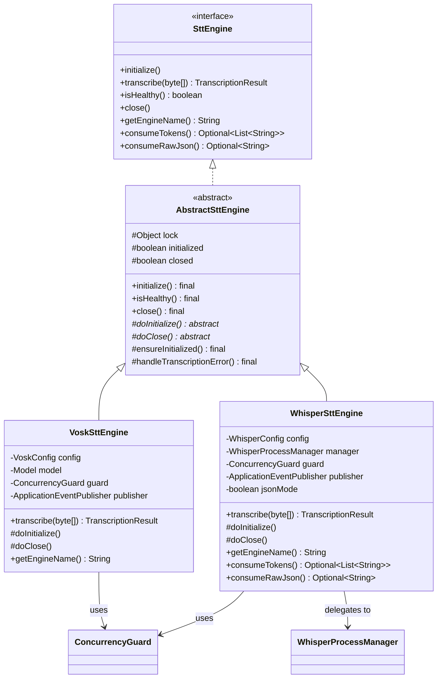
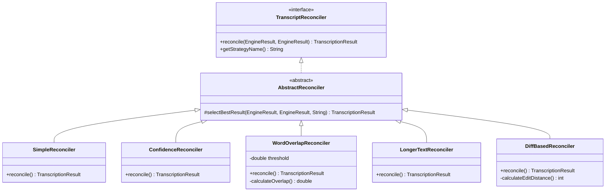
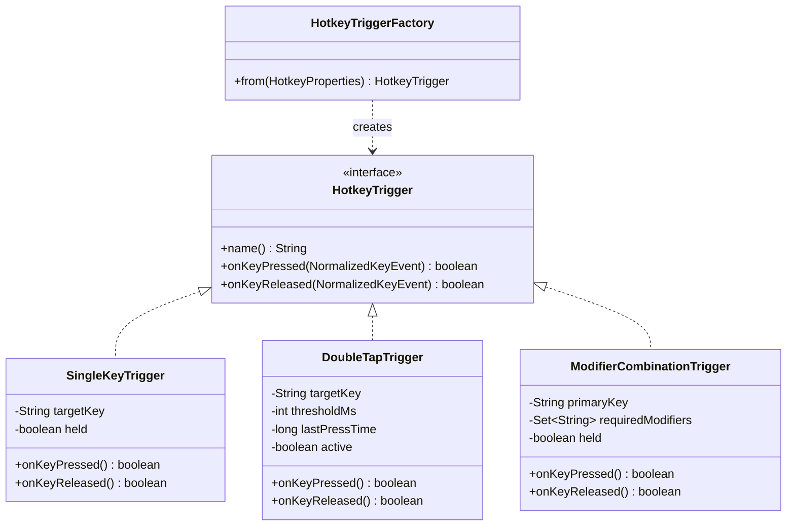
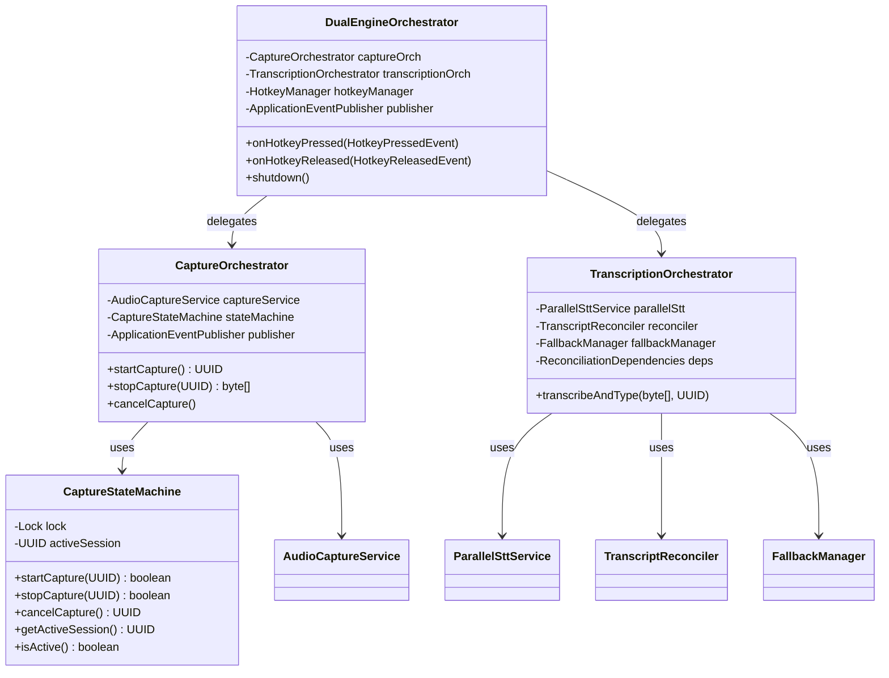
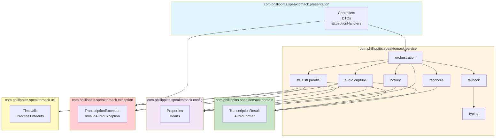
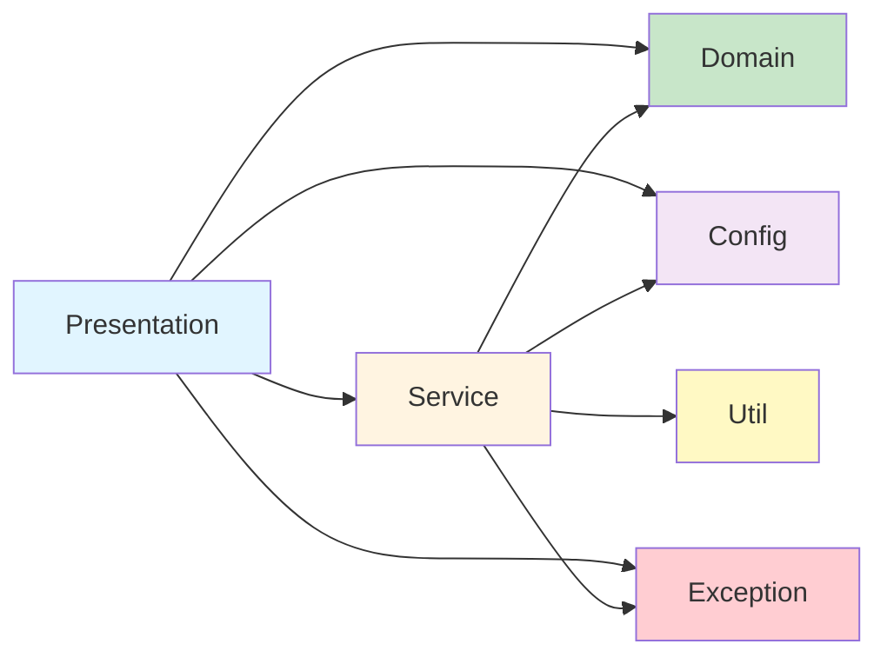
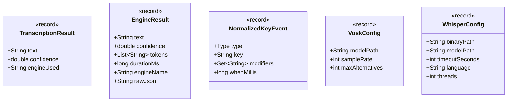

# Class and Package Dependencies

## Core Interface Hierarchy



## Reconciliation Strategy Pattern



## Hotkey Trigger Strategy Pattern



## Orchestration Layer Composition



## Package Dependency Graph



## Dependency Rules

### Allowed Dependencies (Clean Architecture)



### Forbidden Dependencies

| From | To | Reason |
|------|-----|--------|
| Domain | Service | Domain must be pure, no service dependencies |
| Domain | Config | Domain must be configuration-agnostic |
| Config | Service | Configuration should not depend on business logic |
| Util | Service | Utilities must be reusable across layers |
| Exception | Service | Exceptions are cross-cutting concerns |

## Key Design Patterns by Package

| Package | Pattern | Implementation |
|---------|---------|----------------|
| `service.stt` | Template Method | AbstractSttEngine (doInitialize/doClose) |
| `service.reconcile` | Strategy | TranscriptReconciler interface + 5 implementations |
| `service.hotkey` | Strategy + Factory | HotkeyTrigger + HotkeyTriggerFactory |
| `service.stt` | Adapter | VoskSttEngine wraps JNI, WhisperSttEngine wraps binary |
| `service.orchestration` | Facade | DualEngineOrchestrator coordinates subsystems |
| `service.*` | Observer | ApplicationEventPublisher for loose coupling |
| `service.stt` | Object Pool | ConcurrencyGuard with Semaphore |

## Thread Safety Guarantees

| Class | Thread Safety | Mechanism |
|-------|---------------|-----------|
| VoskSttEngine | Thread-safe | Per-call recognizer, synchronized model access |
| WhisperSttEngine | Thread-safe | Per-call temp files, synchronized token cache |
| AbstractSttEngine | Thread-safe | Synchronized state transitions (lock) |
| CaptureStateMachine | Thread-safe | ReentrantLock for all state access |
| PcmRingBuffer | Thread-safe | Synchronized methods |
| ConcurrencyGuard | Thread-safe | Semaphore for bounded concurrency |
| DefaultParallelSttService | Thread-safe | CompletableFuture with bounded executor |
| HotkeyManager | Thread-safe | CopyOnWriteArrayList for listeners |
| All Reconcilers | Thread-safe | Stateless (no shared mutable state) |
| FallbackManager | Thread-safe | Stateless operations |

## Immutable Value Objects

All domain objects are immutable Java 17 records:



## Configuration Binding Flow

```mermaid
flowchart LR
    Props[application.properties] --> Spring[Spring Boot]
    Spring --> VoskProps[@ConfigurationProperties]
    Spring --> WhisperProps[@ConfigurationProperties]
    Spring --> AudioProps[@ConfigurationProperties]
    Spring --> HotkeyProps[@ConfigurationProperties]

    VoskProps --> VoskConfig[VoskConfig record]
    WhisperProps --> WhisperConfig[WhisperConfig record]
    AudioProps --> AudioCaptureProperties[AudioCaptureProperties]
    HotkeyProps --> HotkeyProperties[HotkeyProperties]

    VoskConfig --> Bean1[@Bean VoskSttEngine]
    WhisperConfig --> Bean2[@Bean WhisperSttEngine]

    style Props fill:#f3e5f5
    style Spring fill:#e1f5ff
    style Bean1 fill:#c8e6c9
    style Bean2 fill:#c8e6c9
```
