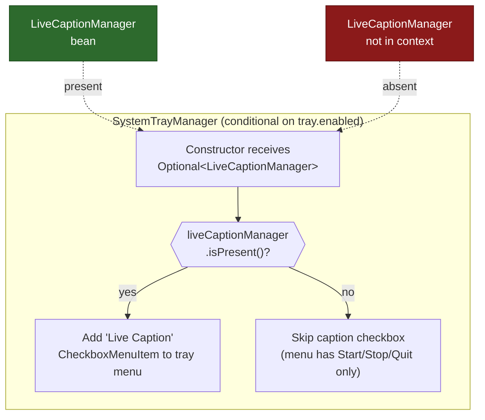
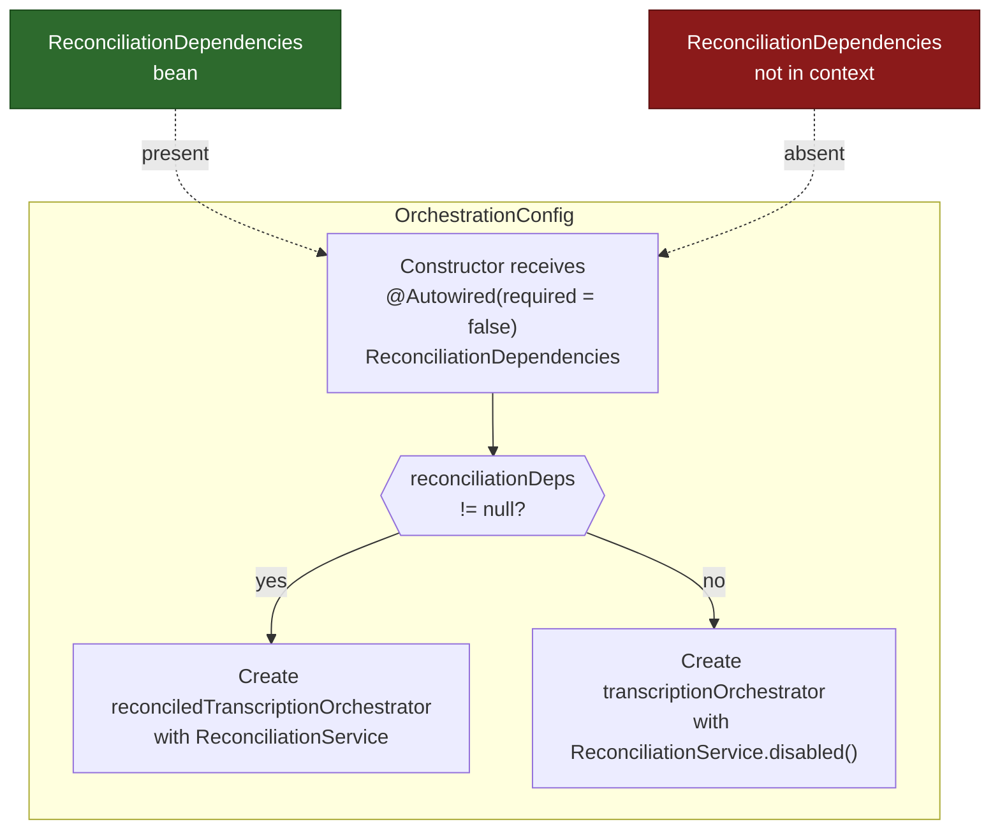
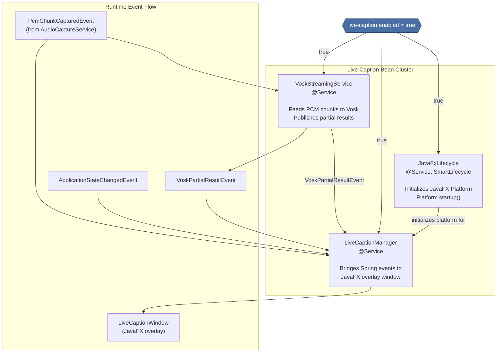
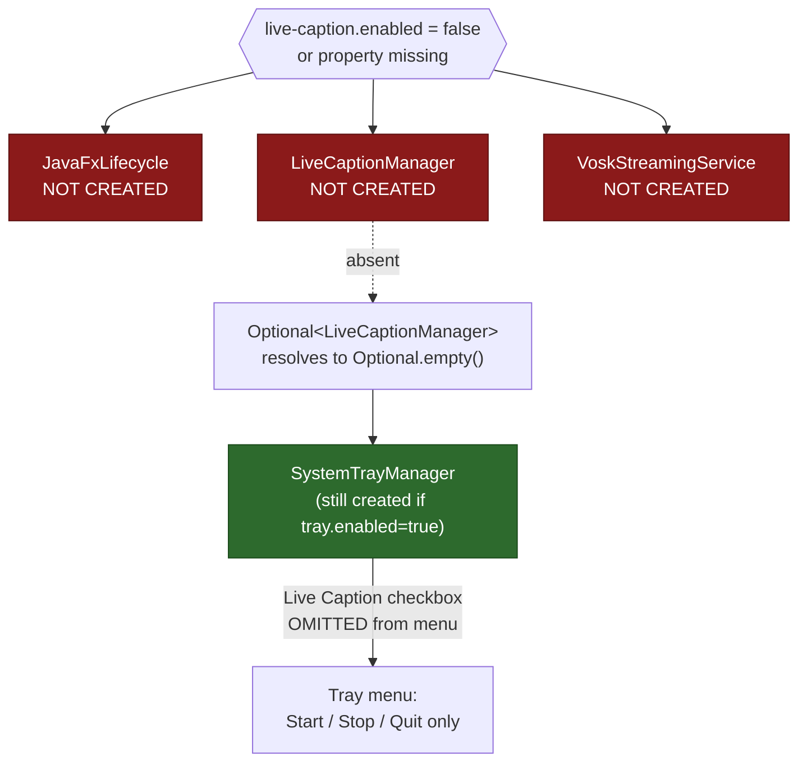
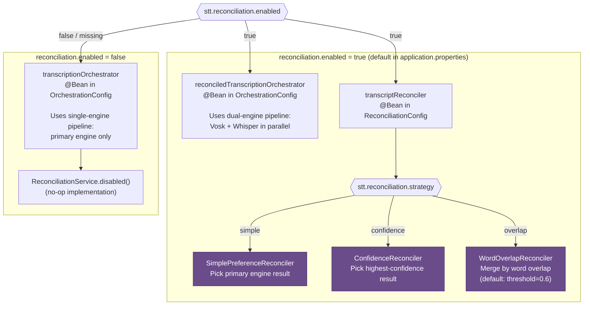
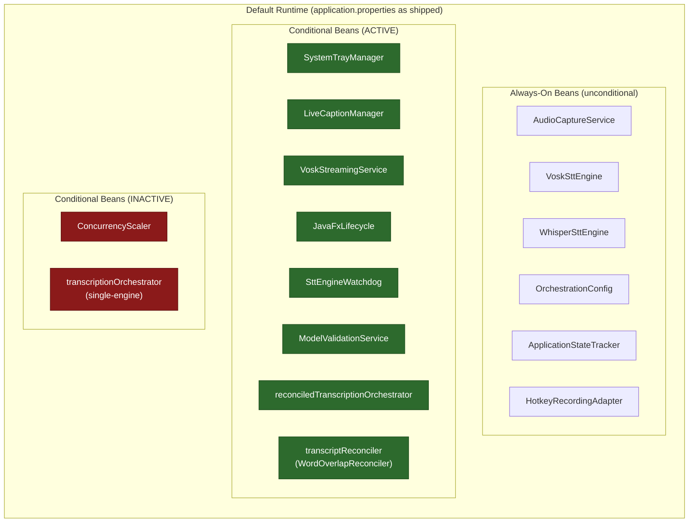
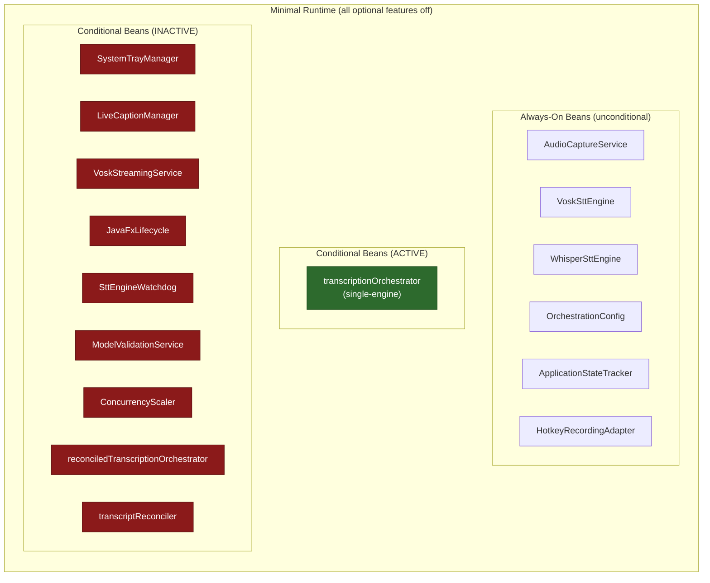

# Conditional Bean Loading Patterns

This document describes the conditional bean loading architecture of the blckvox application.
Every conditional bean is controlled by `@ConditionalOnProperty`, allowing operators to
enable or disable entire feature clusters through `application.properties` without code changes.

---

## Table of Contents

1. [Conditional Bean Loading Flowchart](#1-conditional-bean-loading-flowchart)
2. [Bean Presence Matrix](#2-bean-presence-matrix)
3. [Optional Injection Pattern](#3-optional-injection-pattern)
4. [Live Caption Bean Cluster](#4-live-caption-bean-cluster)
5. [Reconciliation Bean Branching](#5-reconciliation-bean-branching)
6. [Default vs Minimal Runtime](#6-default-vs-minimal-runtime)

---

## 1. Conditional Bean Loading Flowchart

The following flowchart traces every `@ConditionalOnProperty` evaluation during Spring context
initialization. Each diamond represents a property check; green boxes are beans that get
created, red boxes are beans that are skipped.

```mermaid
flowchart TD
    START([Spring Context Initialization]) --> TRAY_CHECK

    %% ── System Tray ──────────────────────────────────────────
    subgraph tray ["System Tray Feature"]
        TRAY_CHECK{{"tray.enabled\n(default: true)"}}
        TRAY_YES["SystemTrayManager\n@Service, SmartLifecycle"]:::created
        TRAY_NO["SystemTrayManager\nSKIPPED"]:::skipped
    end
    TRAY_CHECK -- "true / missing" --> TRAY_YES
    TRAY_CHECK -- "false" --> TRAY_NO

    %% ── Live Caption cluster ─────────────────────────────────
    START --> LC_CHECK
    subgraph livecaption ["Live Caption Feature (3 beans, 1 toggle)"]
        LC_CHECK{{"live-caption.enabled\n(default: true)"}}
        LC_YES_1["LiveCaptionManager\n@Service"]:::created
        LC_YES_2["VoskStreamingService\n@Service"]:::created
        LC_YES_3["JavaFxLifecycle\n@Service, SmartLifecycle"]:::created
        LC_NO_1["LiveCaptionManager\nSKIPPED"]:::skipped
        LC_NO_2["VoskStreamingService\nSKIPPED"]:::skipped
        LC_NO_3["JavaFxLifecycle\nSKIPPED"]:::skipped
    end
    LC_CHECK -- "true" --> LC_YES_1
    LC_CHECK -- "true" --> LC_YES_2
    LC_CHECK -- "true" --> LC_YES_3
    LC_CHECK -- "false / missing" --> LC_NO_1
    LC_CHECK -- "false / missing" --> LC_NO_2
    LC_CHECK -- "false / missing" --> LC_NO_3

    %% ── Watchdog ─────────────────────────────────────────────
    START --> WD_CHECK
    subgraph watchdog ["Engine Watchdog Feature"]
        WD_CHECK{{"stt.watchdog.enabled\n(default: true)"}}
        WD_YES["SttEngineWatchdog\n@Component"]:::created
        WD_NO["SttEngineWatchdog\nSKIPPED"]:::skipped
    end
    WD_CHECK -- "true / missing" --> WD_YES
    WD_CHECK -- "false" --> WD_NO

    %% ── Model Validation ─────────────────────────────────────
    START --> MV_CHECK
    subgraph validation ["Model Validation Feature"]
        MV_CHECK{{"stt.validation.enabled\n(default: true)"}}
        MV_YES["ModelValidationService\n@Component"]:::created
        MV_NO["ModelValidationService\nSKIPPED"]:::skipped
    end
    MV_CHECK -- "true / missing" --> MV_YES
    MV_CHECK -- "false" --> MV_NO

    %% ── Concurrency Scaler ───────────────────────────────────
    START --> CS_CHECK
    subgraph concurrency ["Dynamic Concurrency Feature"]
        CS_CHECK{{"stt.concurrency\n.dynamic-scaling-enabled\n(default: false)"}}
        CS_YES["ConcurrencyScaler\n@Component"]:::created
        CS_NO["ConcurrencyScaler\nSKIPPED"]:::skipped
    end
    CS_CHECK -- "true" --> CS_YES
    CS_CHECK -- "false / missing" --> CS_NO

    %% ── Reconciliation ───────────────────────────────────────
    START --> REC_CHECK
    subgraph reconciliation ["Reconciliation Feature (mutually exclusive beans)"]
        REC_CHECK{{"stt.reconciliation.enabled\n(default via props: true)"}}
        REC_SINGLE["transcriptionOrchestrator\n(single-engine)"]:::created
        REC_DUAL["reconciledTranscriptionOrchestrator\n(dual-engine)"]:::created
        REC_STRAT["transcriptReconciler\n(strategy bean)"]:::created
        REC_SINGLE_NO["transcriptionOrchestrator\nSKIPPED"]:::skipped
        REC_DUAL_NO["reconciledTranscriptionOrchestrator\nSKIPPED"]:::skipped
        REC_STRAT_NO["transcriptReconciler\nSKIPPED"]:::skipped
    end
    REC_CHECK -- "false / missing" --> REC_SINGLE
    REC_CHECK -- "false / missing" --> REC_DUAL_NO
    REC_CHECK -- "false / missing" --> REC_STRAT_NO
    REC_CHECK -- "true" --> REC_DUAL
    REC_CHECK -- "true" --> REC_STRAT
    REC_CHECK -- "true" --> REC_SINGLE_NO

    %% ── Styles ───────────────────────────────────────────────
    classDef created fill:#2d6a2d,stroke:#1a4a1a,color:#ffffff
    classDef skipped fill:#8b1a1a,stroke:#5c1010,color:#ffffff
```



---

## 2. Bean Presence Matrix

The table below shows which conditional beans exist at runtime for each property configuration.
A checkmark means the bean is present in the application context; an "X" means it is absent.

### Property Defaults

| Property | Default Value | Source |
|---|---|---|
| `tray.enabled` | `true` | matchIfMissing=true |
| `live-caption.enabled` | `true` | application.properties |
| `stt.watchdog.enabled` | `true` | application.properties + matchIfMissing=true |
| `stt.validation.enabled` | `true` | application.properties + matchIfMissing=true |
| `stt.concurrency.dynamic-scaling-enabled` | `false` | application.properties (explicit false) |
| `stt.reconciliation.enabled` | `true` | application.properties |

### Bean Presence by Configuration Profile

| Bean | Default (all on) | Minimal (all off) | No Live Caption | No Reconciliation | No Watchdog |
|---|---|---|---|---|---|
| **SystemTrayManager** | yes | no | yes | yes | yes |
| **LiveCaptionManager** | yes | no | no | yes | yes |
| **VoskStreamingService** | yes | no | no | yes | yes |
| **JavaFxLifecycle** | yes | no | no | yes | yes |
| **SttEngineWatchdog** | yes | no | yes | yes | no |
| **ModelValidationService** | yes | no | yes | yes | yes |
| **ConcurrencyScaler** | no | no | no | no | no |
| **transcriptionOrchestrator** (single) | no | yes | no | yes | no |
| **reconciledTranscriptionOrchestrator** (dual) | yes | no | yes | no | yes |
| **transcriptReconciler** | yes | no | yes | no | yes |

> **Note:** ConcurrencyScaler is disabled by default (`dynamic-scaling-enabled=false`).
> It must be explicitly set to `true` to activate. The "Default (all on)" column reflects
> the shipped `application.properties`, where this property is `false`.

### Profile Property Values

| Profile | tray.enabled | live-caption.enabled | stt.watchdog.enabled | stt.validation.enabled | stt.concurrency.dynamic-scaling-enabled | stt.reconciliation.enabled |
|---|---|---|---|---|---|---|
| **Default** | true | true | true | true | false | true |
| **Minimal** | false | false | false | false | false | false |
| **No Live Caption** | true | false | true | true | false | true |
| **No Reconciliation** | true | true | true | true | false | false |
| **No Watchdog** | true | true | false | true | false | true |

---

## 3. Optional Injection Pattern

The application uses two patterns to tolerate missing conditional beans at injection points:
`Optional<T>` constructor parameters and `@Autowired(required = false)`.





### Code Pattern: SystemTrayManager

```java
// Constructor injection with Optional
public SystemTrayManager(RecordingService recordingService,
                         ApplicationContext applicationContext,
                         Optional<LiveCaptionManager> liveCaptionManager) {
    this.liveCaptionManager = liveCaptionManager;
}

// Conditional menu construction
liveCaptionManager.ifPresent(manager -> {
    popup.addSeparator();
    CheckboxMenuItem captionItem = new CheckboxMenuItem("Live Caption");
    captionItem.setState(manager.isEnabled());
    captionItem.addItemListener(e ->
        Thread.ofVirtual().start(() -> manager.setEnabled(captionItem.getState())));
    popup.add(captionItem);
});
```

### Code Pattern: OrchestrationConfig

```java
// Constructor injection with @Autowired(required = false)
public OrchestrationConfig(AudioCaptureService captureService,
                           SttEngine voskSttEngine,
                           SttEngine whisperSttEngine,
                           SttEngineWatchdog watchdog,
                           OrchestrationProperties orchestrationProperties,
                           HotkeyProperties hotkeyProperties,
                           ApplicationEventPublisher publisher,
                           TranscriptionMetricsPublisher metricsPublisher,
                           @Autowired(required = false)
                           ReconciliationDependencies reconciliationDeps) {
    this.reconciliationDeps = reconciliationDeps; // may be null
}
```

---

## 4. Live Caption Bean Cluster

Three beans share the single `live-caption.enabled` toggle. Disabling this one property
removes the entire live caption subsystem from the application context.



### What Happens When Disabled



---

## 5. Reconciliation Bean Branching

The `stt.reconciliation.enabled` property controls a mutually exclusive pair of
`TranscriptionOrchestrator` implementations and a strategy bean.



### Reconciliation Strategy Selection Detail

The `transcriptReconciler` bean in `ReconciliationConfig` uses a `switch` expression
to create the appropriate strategy implementation:

```java
@Bean
@ConditionalOnProperty(prefix = "stt.reconciliation", name = "enabled", havingValue = "true")
public TranscriptReconciler transcriptReconciler(ReconciliationProperties props,
                                                 OrchestrationProperties orchestrationProperties) {
    return switch (props.getStrategy()) {
        case SIMPLE     -> new SimplePreferenceReconciler(orchestrationProperties.getPrimaryEngine());
        case CONFIDENCE -> new ConfidenceReconciler();
        case OVERLAP    -> new WordOverlapReconciler(props.getOverlapThreshold());
    };
}
```

### Mutual Exclusivity

Both `@Bean` methods in `OrchestrationConfig` produce the same type
(`TranscriptionOrchestrator`), so exactly one must be active at any time:

| `stt.reconciliation.enabled` | `transcriptionOrchestrator` (single) | `reconciledTranscriptionOrchestrator` (dual) | `transcriptReconciler` |
|---|---|---|---|
| `true` | skipped | **created** | **created** |
| `false` or missing | **created** | skipped | skipped |

---

## 6. Default vs Minimal Runtime

### Default Runtime

The application context when started with the shipped `application.properties`
(all features enabled except ConcurrencyScaler).



### Minimal Runtime

The application context when all optional features are disabled.

```properties
# Minimal configuration
tray.enabled=false
live-caption.enabled=false
stt.watchdog.enabled=false
stt.validation.enabled=false
stt.concurrency.dynamic-scaling-enabled=false
stt.reconciliation.enabled=false
```



### Side-by-Side Comparison

| Bean | Default | Minimal | Delta |
|---|---|---|---|
| SystemTrayManager | yes | no | Loses tray icon, visual state feedback |
| LiveCaptionManager | yes | no | Loses caption overlay |
| VoskStreamingService | yes | no | Loses streaming partial transcription |
| JavaFxLifecycle | yes | no | JavaFX platform never starts |
| SttEngineWatchdog | yes | no | Loses auto-restart on engine failure |
| ModelValidationService | yes | no | No startup model validation (risk of confusing runtime errors) |
| ConcurrencyScaler | no | no | Static limits in both profiles |
| reconciledTranscriptionOrchestrator | yes | no | Loses dual-engine reconciliation |
| transcriptReconciler | yes | no | No strategy bean needed |
| transcriptionOrchestrator (single) | no | yes | Falls back to single-engine pipeline |
| **Total conditional beans** | **8** | **1** | **-7 beans** |

### Key Behavioral Differences

- **Default**: Full-featured with dual-engine STT reconciliation (overlap strategy at 0.6 threshold),
  live caption overlay, system tray icon, engine watchdog with auto-restart, and startup model validation.
- **Minimal**: Bare-bones STT pipeline with single-engine transcription only. No visual feedback,
  no streaming captions, no fault recovery, no startup validation. Suitable for headless/CI environments
  or resource-constrained deployments.
