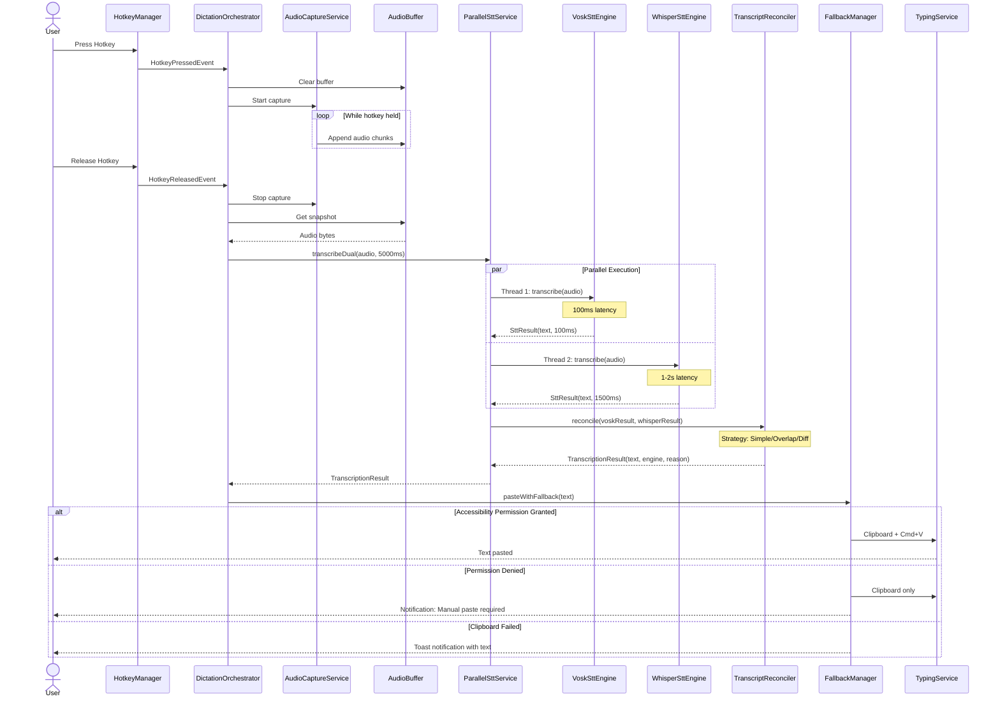
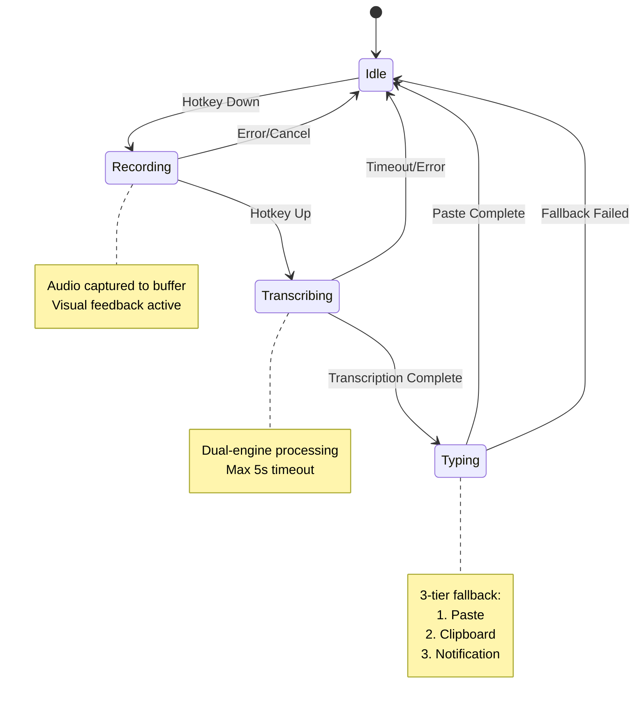
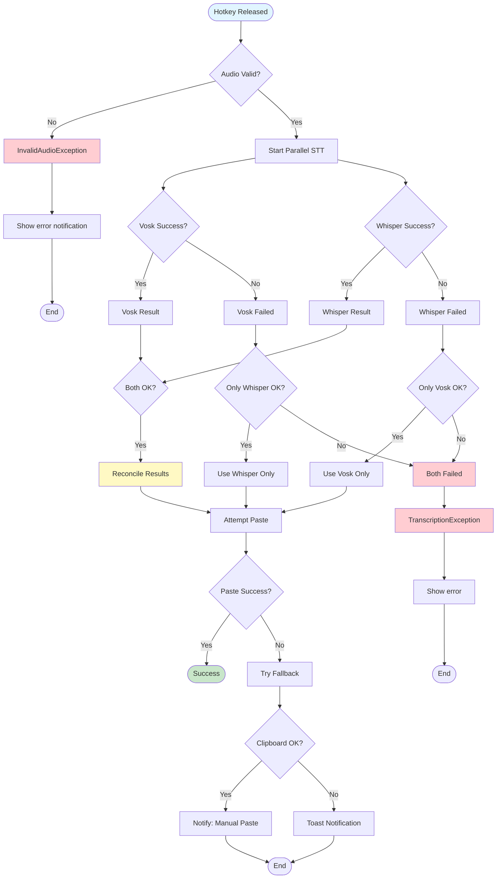
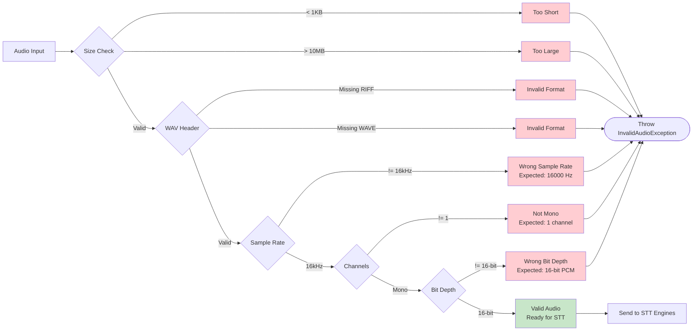

# speakToMack Data Flow Diagram

## Complete Transcription Pipeline

## State Machine: Dictation Session

## Parallel Processing Timeline

```mermaid
gantt
    title Dual-Engine Transcription Timeline
    dateFormat X
    axisFormat %L ms
    
    section User Action
    Press hotkey           :0, 0
    Speak (2 seconds)      :0, 2000
    Release hotkey         :2000, 2000
    
    section Audio
    Capture audio          :0, 2000
    Buffer snapshot        :2000, 50
    
    section STT Processing
    Vosk transcribe        :2050, 100
    Whisper transcribe     :2050, 1500
    Wait for both          :2050, 1500
    
    section Reconciliation
    Reconcile results      :3550, 50
    
    section Output
    Paste text             :3600, 100
    
    section Total Latency
    User wait time         :milestone, 3700, 0
```

## Error Handling Flow

## Audio Format Validation Pipeline

