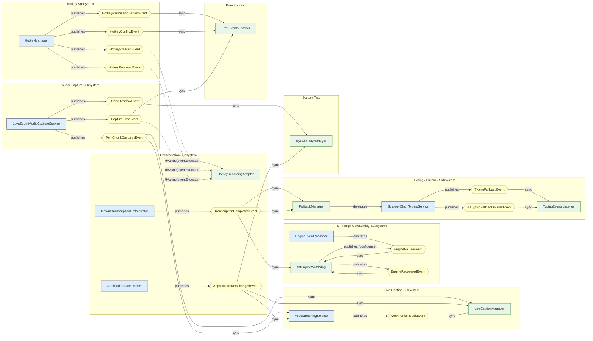
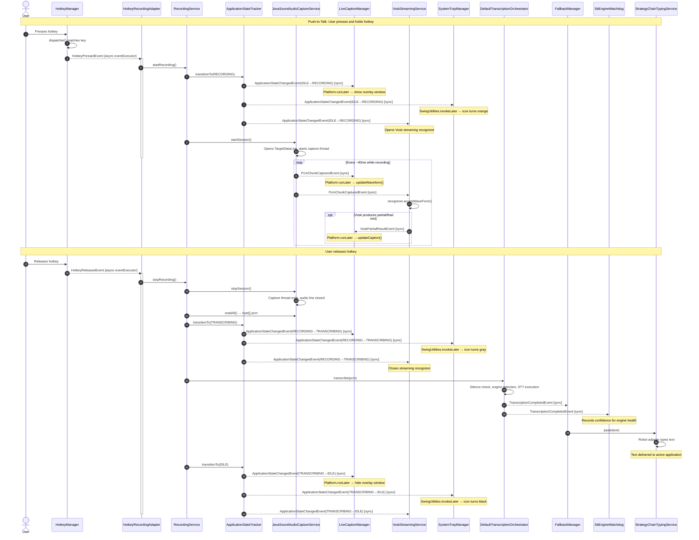
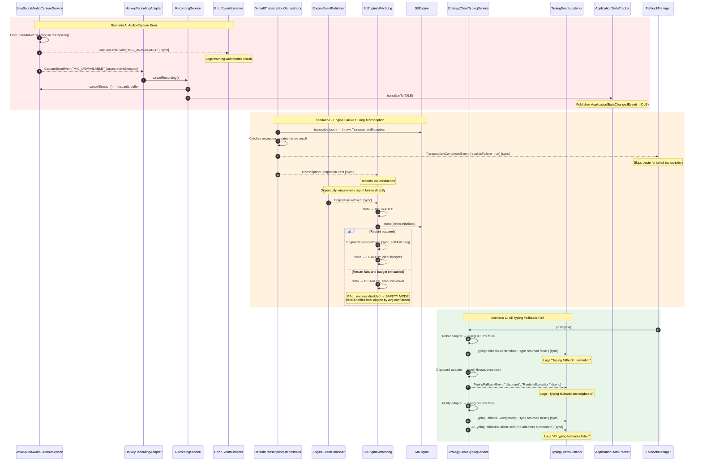
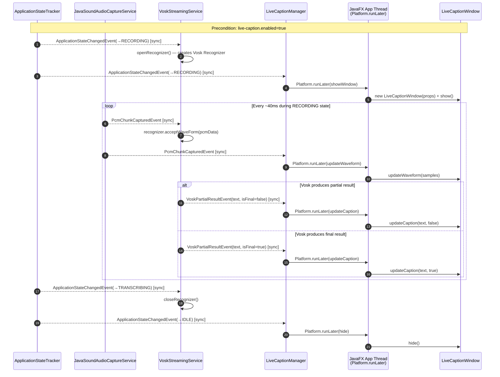

# Event Flow Map

This document is the definitive reference for the Spring event wiring in the blckvox application. It covers all 15 event types, their publishers, listeners, record fields, and threading models. Blckvox is a Spring Boot event-driven desktop application with no HTTP layer; all inter-component communication flows through `ApplicationEventPublisher`. The diagrams below use Mermaid syntax and are organized from a complete wiring overview down to focused sub-flows and error paths.

---

## 1. Complete Event Wiring Map

This flowchart shows every event as a node connecting its publisher to its listener(s). Events are grouped by subsystem. Edge colors encode the threading model: green for synchronous delivery on the publisher thread, orange for `@Async("eventExecutor")` delivery on a pooled thread, and blue for `Platform.runLater` (JavaFX Application Thread) delivery inside the listener body.

**Legend**

| Edge style | Threading model |
|---|---|
| Solid arrow (`-->`) with label `sync` | Synchronous -- listener runs on the publisher's thread |
| Dashed arrow (`.->`) with label `@Async(eventExecutor)` | Asynchronous -- listener runs on the `eventExecutor` thread pool |
| Inside listener body: `Platform.runLater` | JavaFX Application Thread -- noted in listener implementations (LiveCaptionManager, SystemTrayManager uses `SwingUtilities.invokeLater`) |

---

## 2. Happy Path Event Chain

This sequence diagram traces a single successful push-to-talk dictation session from hotkey press to pasted text. It includes every `ApplicationStateChangedEvent` fired at each state transition.

---

## 3. Error Path Event Chains

This diagram shows three error scenarios that diverge from the happy path.

---

## 4. Event Payload Reference Table

Every event record, its fields, publisher(s), listener(s), and threading model in one table.

| # | Event Class | Record Fields | Publisher | Listener(s) | Threading |
|---|---|---|---|---|---|
| 1 | `HotkeyPressedEvent` | `Instant at` | `HotkeyManager` | `HotkeyRecordingAdapter.onHotkeyPressed()` | `@Async("eventExecutor")` |
| 2 | `HotkeyReleasedEvent` | `Instant at` | `HotkeyManager` | `HotkeyRecordingAdapter.onHotkeyReleased()` | `@Async("eventExecutor")` |
| 3 | `HotkeyPermissionDeniedEvent` | `Instant at` | `HotkeyManager.start()` | `ErrorEventsListener.onHotkeyPermissionDenied()` | Sync |
| 4 | `HotkeyConflictEvent` | `String key`, `List<String> modifiers`, `Instant at` | `HotkeyManager.detectReservedConflict()` | `ErrorEventsListener.onHotkeyConflict()` | Sync |
| 5 | `ApplicationStateChangedEvent` | `ApplicationState previous`, `ApplicationState current`, `Instant timestamp` | `ApplicationStateTracker.transitionTo()` | `LiveCaptionManager.onStateChanged()` (conditional), `SystemTrayManager.onStateChanged()` (conditional), `VoskStreamingService.onStateChanged()` (conditional) | Sync (listeners use `Platform.runLater` / `SwingUtilities.invokeLater` internally) |
| 6 | `PcmChunkCapturedEvent` | `byte[] pcmData`, `int length`, `UUID sessionId` | `JavaSoundAudioCaptureService` (every ~40ms) | `LiveCaptionManager.onPcmChunk()` (conditional), `VoskStreamingService.onPcmChunk()` (conditional) | Sync (LiveCaptionManager uses `Platform.runLater` internally) |
| 7 | `BufferOverflowEvent` | `int droppedBytes`, `int bufferCapacity`, `Instant timestamp` | `JavaSoundAudioCaptureService` (via `PcmRingBuffer` callback) | `SystemTrayManager.onBufferOverflow()` (conditional) | Sync (`SwingUtilities.invokeLater` internally) |
| 8 | `CaptureErrorEvent` | `String reason`, `Instant at` | `JavaSoundAudioCaptureService` | `ErrorEventsListener.onCaptureError()` (sync), `HotkeyRecordingAdapter.onCaptureError()` (`@Async("eventExecutor")`) | Mixed |
| 9 | `TranscriptionCompletedEvent` | `TranscriptionResult result`, `Instant timestamp`, `String engineUsed` | `DefaultTranscriptionOrchestrator.publishResult()` | `FallbackManager.onTranscription()` (sync), `SttEngineWatchdog.onTranscriptionCompleted()` (conditional, sync) | Sync |
| 10 | `VoskPartialResultEvent` | `String text`, `boolean isFinal` | `VoskStreamingService` (conditional) | `LiveCaptionManager.onVoskPartialResult()` (conditional) | Sync (`Platform.runLater` internally) |
| 11 | `EngineFailureEvent` | `String engine`, `Instant at`, `String message`, `Throwable cause`, `Map<String, String> context` | `EngineEventPublisher.publishFailure()` (utility), `SttEngineWatchdog.onTranscriptionCompleted()` (confidence degradation) | `SttEngineWatchdog.onFailure()` (conditional) | Sync |
| 12 | `EngineRecoveredEvent` | `String engine`, `Instant at` | `SttEngineWatchdog.attemptRestart()`, `SttEngineWatchdog.checkAllEnginesDisabled()` | `SttEngineWatchdog.onRecovered()` (self-listening, conditional) | Sync |
| 13 | `TypingFallbackEvent` | `String tier`, `String reason`, `Instant at` | `StrategyChainTypingService.paste()` | `TypingEventsListener.onFallback()` | Sync |
| 14 | `AllTypingFallbacksFailedEvent` | `String reason`, `Instant at` | `StrategyChainTypingService.paste()` | `TypingEventsListener.onAllFailed()` | Sync |

**Conditional beans:** `LiveCaptionManager`, `VoskStreamingService` are active only when `live-caption.enabled=true`. `SystemTrayManager` is active when `tray.enabled=true` (default). `SttEngineWatchdog` is active when `stt.watchdog.enabled=true` (default).

---

## 5. Live Caption Event Sub-flow

This focused diagram isolates the live caption pipeline: PCM audio chunks flow from the capture service through Vosk streaming recognition, producing partial text results that are rendered in the JavaFX overlay window.

### Key threading observations for the live caption path

1. **PcmChunkCapturedEvent** is published on the `audio-capture` daemon thread and delivered synchronously to both `VoskStreamingService` and `LiveCaptionManager`. The Vosk recognizer processes audio under its own `recognizerLock` to avoid contention.

2. **VoskPartialResultEvent** is published on the same `audio-capture` thread (inside the `onPcmChunk` handler) and delivered synchronously to `LiveCaptionManager`.

3. **All UI updates** (waveform, caption text, window show/hide) are marshalled to the JavaFX Application Thread via `Platform.runLater`, ensuring thread safety for the overlay window.

4. Both `VoskStreamingService` and `LiveCaptionManager` are conditional beans gated on `live-caption.enabled=true`. When disabled, neither bean is instantiated and no live caption events are published or consumed.
