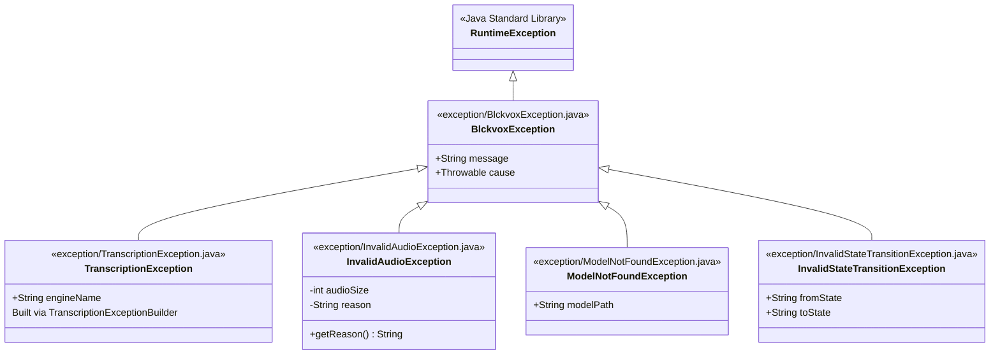
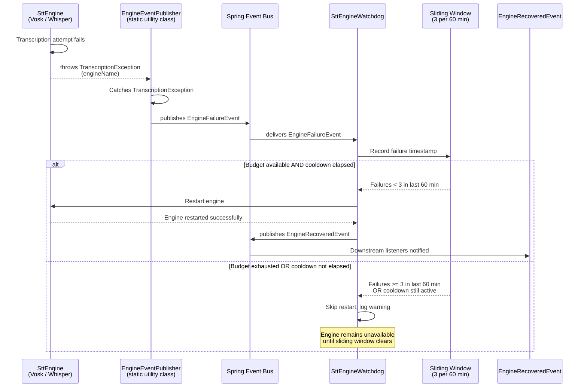
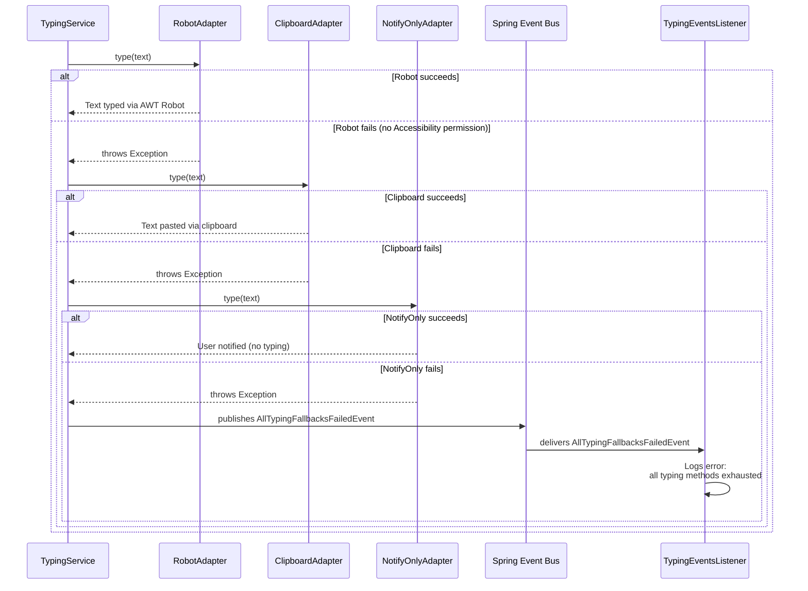
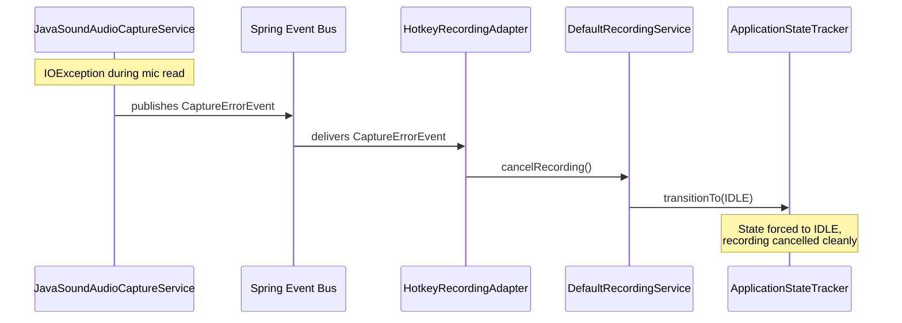
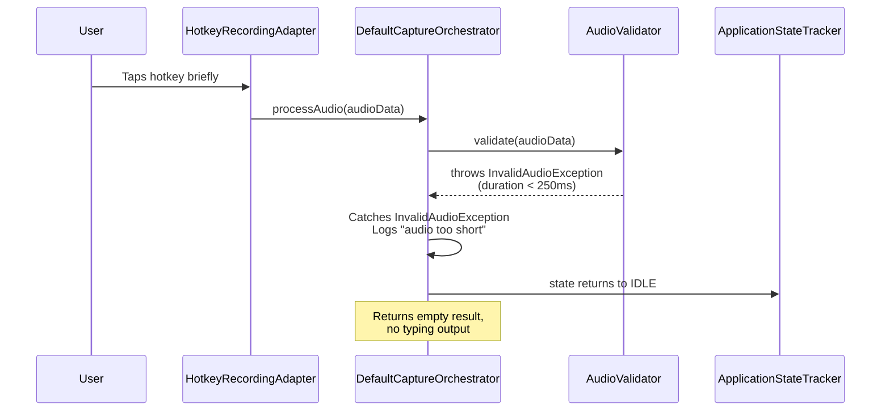
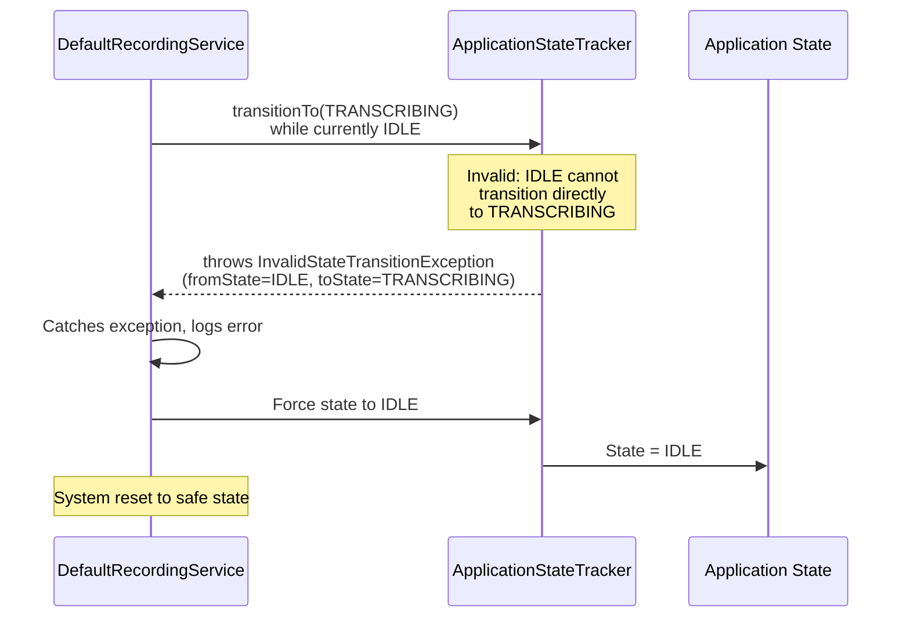

# Exception Hierarchy and Error Recovery

This document describes the exception hierarchy, throw/catch relationships, and error recovery patterns in the blckvox application.

---

## 1. Exception Hierarchy Tree

---

## 2. Exception Throw and Catch Map

```mermaid
flowchart TB
    subgraph THROWN_BY["Exception Sources"]
        direction TB
        Vosk["VoskSttEngine<br/>(JNI errors)"]
        Whisper["WhisperSttEngine<br/>(process timeout / exit code)"]
        ParallelStt["DefaultParallelSttService<br/>(both engines fail)"]
        AudioVal["AudioValidator<br/>(duration too short/long,<br/>wrong format)"]
        ModelVal["ModelValidationService<br/>(@PostConstruct)"]
        StateTracker["ApplicationStateTracker<br/>.transitionTo()"]
    end

    subgraph EXCEPTIONS["Exceptions"]
        direction TB
        TE["TranscriptionException"]
        IAE["InvalidAudioException"]
        MNFE["ModelNotFoundException"]
        ISTE["InvalidStateTransitionException"]
    end

    subgraph CAUGHT_BY["Exception Handlers"]
        direction TB
        Orch["DefaultTranscriptionOrchestrator<br/>&#8594; publishes TranscriptionCompletedEvent<br/>with failure flag"]
        EngPub["EngineEventPublisher<br/>(static utility, not a Spring bean)<br/>&#8594; publishes EngineFailureEvent<br/>&#8594; watchdog evaluates restart"]
        Recon["DefaultReconciliationService<br/>&#8594; falls back to single<br/>engine result"]
        CapOrch["DefaultCaptureOrchestrator<br/>&#8594; logs warning,<br/>returns empty result,<br/>state &#8594; IDLE"]
        Spring["Spring Context<br/>&#8594; FAIL-FAST,<br/>application will not start"]
        RecSvc["DefaultRecordingService<br/>&#8594; logs error,<br/>forces state to IDLE"]
    end

    Vosk -->|throws| TE
    Whisper -->|throws| TE
    ParallelStt -->|throws| TE
    AudioVal -->|throws| IAE
    ModelVal -->|throws| MNFE
    StateTracker -->|throws| ISTE

    TE -->|caught by| Orch
    TE -->|caught by| EngPub
    TE -->|caught by| Recon
    IAE -->|caught by| CapOrch
    MNFE -->|caught by| Spring
    ISTE -->|caught by| RecSvc
```

---

## 3. Engine Failure Recovery Sequence

---

## 4. Typing Fallback Cascade

---

## 5. Capture Error and Audio Validation Flows

---

## 6. Invalid State Transition Recovery

---

## 7. Error Recovery Summary Table

| Error Scenario | Exception | Thrown By | Caught By | Recovery Action | User Impact |
|---|---|---|---|---|---|
| Vosk JNI error | `TranscriptionException` | `VoskSttEngine` | `EngineEventPublisher` | Publishes `EngineFailureEvent`; watchdog evaluates restart budget (3 per 60 min); restarts engine if budget available | Momentary delay; next transcription uses restarted engine or surviving engine |
| Whisper process timeout or bad exit code | `TranscriptionException` | `WhisperSttEngine` | `EngineEventPublisher` | Same watchdog restart flow as above | Same as above |
| Both engines fail | `TranscriptionException` | `DefaultParallelSttService` | `DefaultTranscriptionOrchestrator` | Publishes `TranscriptionCompletedEvent` with failure flag; `FallbackManager` skips typing | No text typed; user must retry |
| Single engine fails during reconciliation | `TranscriptionException` | One of `VoskSttEngine` / `WhisperSttEngine` | `DefaultReconciliationService` | Uses the successful engine's result only | Slightly reduced accuracy (single-engine result instead of reconciled) |
| Audio too short (< 250ms) | `InvalidAudioException` | `AudioValidator` | `DefaultCaptureOrchestrator` | Logs warning; returns empty result; state returns to IDLE | No text typed; user should hold hotkey longer |
| Audio wrong format or too long | `InvalidAudioException` | `AudioValidator` | `DefaultCaptureOrchestrator` | Same as audio-too-short recovery | No text typed; check audio input settings |
| STT model file missing at startup | `ModelNotFoundException` | `ModelValidationService` | Spring Context | Application fails to start (fail-fast) | App does not launch; user must install models |
| Invalid state transition (e.g., double start) | `InvalidStateTransitionException` | `ApplicationStateTracker` | `DefaultRecordingService` | Forces state to IDLE; logs error | Current operation cancelled; user can retry immediately |
| Mic read IOException during capture | `IOException` (not a `BlckvoxException`) | `JavaSoundAudioCaptureService` | `HotkeyRecordingAdapter` (via `CaptureErrorEvent`) | Calls `cancelRecording()`; state returns to IDLE | Recording lost; user must retry |
| All typing fallbacks fail | Various exceptions | `RobotAdapter`, `ClipboardAdapter`, `NotifyOnlyAdapter` | Typing service publishes `AllTypingFallbacksFailedEvent` | `TypingEventsListener` logs error | Transcription succeeded but text cannot be typed; check Accessibility permissions |
