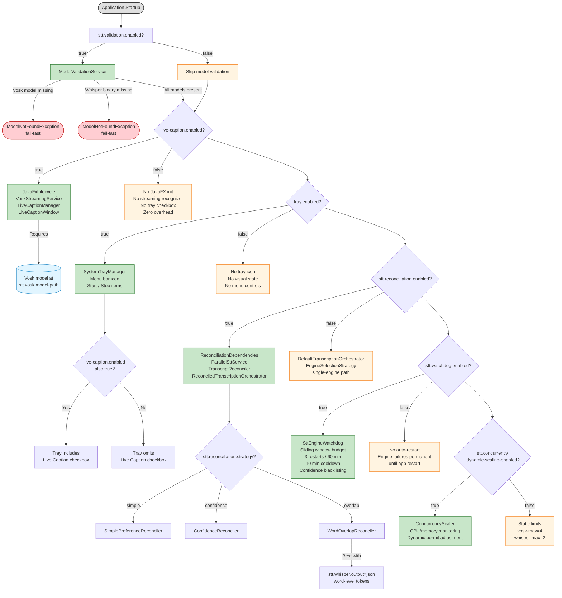
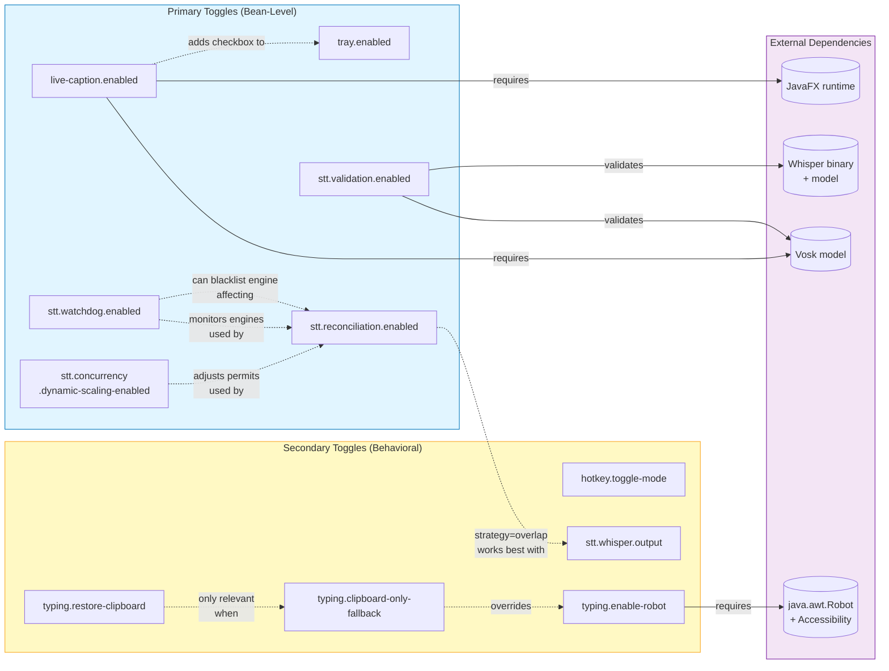
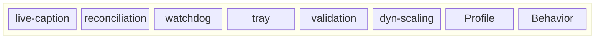
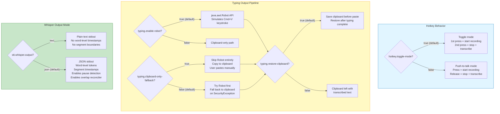

# Feature Toggle Matrix

Complete reference for all feature toggles in the blckvox application,
documenting bean-level toggles that control Spring component loading and
behavioral toggles that modify runtime behavior without affecting bean creation.

---

## 1. Feature Toggle Decision Flowchart

Shows each primary toggle as a decision diamond, the beans and subsystems
activated for each path, and inter-toggle dependencies.

---

## 2. Configuration Scenarios Table

Realistic configuration profiles showing which toggles are active, the
resulting subsystem footprint, expected latency characteristics, and
intended use case.

| Scenario | `live-caption` | `reconciliation` | `watchdog` | `tray` | `validation` | `dynamic-scaling` | Active Subsystems | Latency Profile | Use Case |
|---|---|---|---|---|---|---|---|---|---|
| **Default (Production)** | true | true (overlap) | true | true | true | false | All subsystems active. Dual-engine parallel STT with overlap reconciliation. Tray icon with live caption checkbox. Watchdog monitors health. Static concurrency. | Medium -- two engines run in parallel, reconciliation adds post-processing | Full-featured desktop deployment on macOS with all safety nets |
| **Fast Mode** | false | false | true | true | true | false | Single-engine STT via EngineSelectionStrategy. Tray icon without caption checkbox. Watchdog protects the single engine. | Low -- only one engine runs per transcription, no reconciliation overhead | When speed matters more than accuracy, or hardware is limited |
| **Maximum Accuracy** | true | true (overlap) | true | true | true | true | Everything active plus dynamic scaling. ConcurrencyScaler adjusts permits under load. JSON whisper output for word-level tokens. | Higher -- dual-engine plus dynamic scaling overhead, but best accuracy | Transcription-critical workloads where accuracy is paramount |
| **Headless / CI** | false | true (simple) | true | false | true | false | No UI components. No tray, no JavaFX. Dual-engine reconciliation still active. | Medium -- dual-engine without UI overhead | Server-side or CI/CD pipeline transcription, no display available |
| **Minimal** | false | false | false | false | false | false | Bare STT only. Single engine, no validation, no watchdog, no UI. Smallest bean graph. | Lowest -- single engine, zero overhead from ancillary subsystems | Development / debugging with mock engines, test profiles |
| **Testing (Unit)** | false | false | false | false | false | false | Same as Minimal. `stt.validation.enabled=false` prevents ModelNotFoundException with mocked engines. | N/A -- unit tests with mocked services | `@SpringBootTest` with `application-test.properties` |
| **Presentation Demo** | true | false | true | true | true | false | Single-engine for speed with full UI. Live captions provide visual feedback for demos. Watchdog keeps engine alive. | Low-Medium -- single engine with UI overlay | Live demos, presentations, screen recordings |
| **High-Throughput** | false | true (confidence) | true | false | false | true | No UI. Confidence-based reconciliation skips dual-engine when Vosk is confident. Dynamic scaling adapts to load. | Variable -- single-engine when confident, dual-engine when uncertain | Batch processing, multi-user server scenarios |

---

## 3. Toggle Dependency Graph

Shows which toggles depend on, interact with, or enhance other toggles.
Solid arrows indicate hard dependencies; dashed arrows indicate soft
interactions where one toggle enhances or modifies the behavior of another.

### Dependency Notes

| Relationship | Type | Detail |
|---|---|---|
| `live-caption` --> Vosk model | Hard | `VoskStreamingService` loads the model at `stt.vosk.model-path` for real-time streaming recognition |
| `live-caption` --> JavaFX | Hard | `JavaFxLifecycle` calls `Platform.startup()` to initialize the JavaFX toolkit |
| `live-caption` --> `tray` | Soft | When both are true, `SystemTrayManager` adds a "Live Caption" `CheckboxMenuItem`; when `live-caption` is false the checkbox is omitted |
| `reconciliation` (overlap) --> `whisper.output=json` | Soft | `WordOverlapReconciler` benefits from word-level timestamp tokens only available in JSON mode |
| `watchdog` --> `reconciliation` | Soft | Watchdog can blacklist a low-confidence engine, which degrades dual-engine reconciliation to single-engine fallback |
| `dynamic-scaling` --> `reconciliation` | Soft | ConcurrencyScaler adjusts the permits in `DynamicConcurrencyGuard`, which gates how many parallel engine invocations `ParallelSttService` can run |
| `clipboard-only-fallback` --> `enable-robot` | Override | When `clipboard-only-fallback=true`, the Robot API is bypassed regardless of `enable-robot` |
| `restore-clipboard` --> paste path | Conditional | Only meaningful when text is delivered via clipboard paste (either `clipboard-only-fallback=true` or Robot fallback) |
| `validation` --> Vosk/Whisper | Hard | `ModelValidationService` checks directory structure (Vosk) and binary+model existence (Whisper) at startup; throws `ModelNotFoundException` on failure |

---

## 4. Runtime Behavior Matrix

Truth table for the 6 primary toggles in realistic combinations.
Each row describes the resulting system behavior. Only meaningful
combinations are listed (not all 64 permutations).

| # | `live-caption` | `reconciliation` | `watchdog` | `tray` | `validation` | `dyn-scaling` | Profile Name | System Behavior |
|---|:-:|:-:|:-:|:-:|:-:|:-:|---|---|
| 1 | T | T | T | T | T | F | **Default** | Full UI. Dual-engine with overlap reconciliation. Watchdog auto-restarts. Tray with caption checkbox. Models validated at startup. Static concurrency (vosk=4, whisper=2). |
| 2 | F | F | T | T | T | F | **Fast Mode** | No JavaFX. Single engine via `EngineSelectionStrategy`. Watchdog protects active engine. Tray shows state but no caption checkbox. Models validated. |
| 3 | F | T | T | F | T | F | **Headless** | No UI at all. Dual-engine reconciliation runs server-side. Watchdog monitors both engines. Models validated. Suitable for headless Linux / CI. |
| 4 | T | T | T | T | T | T | **Max Accuracy** | Everything on. Dynamic scaling adjusts concurrency based on CPU (>80%) and memory (>85%). Best accuracy at cost of resource monitoring overhead. |
| 5 | F | F | F | F | F | F | **Minimal / Test** | Bare bones. Single engine, no validation (won't throw on missing models), no watchdog, no UI. Ideal for `@SpringBootTest` with mocks. |
| 6 | T | F | T | T | T | F | **Demo** | Live captions for visual feedback. Single engine for speed. Watchdog keeps it alive. Tray shows recording state. Good for presentations. |
| 7 | F | T | T | F | F | T | **High-Throughput** | No UI, no validation. Dual-engine with dynamic scaling. Watchdog auto-recovers. Skips validation for container deployments with pre-validated images. |
| 8 | F | F | T | T | F | F | **Dev Sandbox** | Tray for manual Start/Stop. Single engine. Watchdog recovery. No validation (allows hot-swapping models). No caption overlay. |

### Reading the Matrix

- **T** = toggle is `true` (bean is loaded / feature is active)
- **F** = toggle is `false` (bean is skipped / feature is inactive)
- Row 1 matches the defaults shipped in `application.properties`
- Row 5 matches the typical `application-test.properties` override

---

## 5. Secondary Toggles Reference

Behavioral toggles that do not control Spring bean creation but modify
runtime behavior within already-loaded components.

### Secondary Toggle Summary

### Secondary Toggle Detail Table

| Property | Default | Type | Controlled By | Effect When True | Effect When False | Notes |
|---|---|---|---|---|---|---|
| `hotkey.toggle-mode` | `true` | boolean | `HotkeyProperties` | Toggle: first activation starts recording, second stops and triggers transcription | Push-to-talk: key-down starts, key-up stops and triggers transcription | Both modes use the same hotkey (`hotkey.key` + `hotkey.type`) |
| `typing.enable-robot` | `true` | boolean | `TypingService` | Uses `java.awt.Robot` to simulate paste keystroke (Cmd+V on macOS) | Robot API is never instantiated; all output goes through clipboard | Requires macOS Accessibility permission for Robot |
| `typing.clipboard-only-fallback` | `false` | boolean | `TypingService` | Skips Robot entirely; copies text to clipboard and expects user to paste | Attempts Robot first, falls back to clipboard on failure | Overrides `enable-robot` when true |
| `typing.restore-clipboard` | `true` | boolean | `TypingService` | Saves current clipboard content before paste, restores it afterward | Clipboard retains the transcribed text after paste | Only relevant when clipboard is used (always for fallback, always for clipboard-only) |
| `stt.whisper.output` | `json` | enum | `WhisperSttEngine` | JSON output with word-level tokens and segment timestamps; enables `WordOverlapReconciler` and silence-gap paragraph breaks | Plain text output only; `WordOverlapReconciler` degrades, no segment-based pause detection | Must be `json` for `stt.orchestration.silence-gap-ms` to work with Whisper |

### Typing Pipeline Decision Tree

The following table shows the effective output method based on the
combination of typing toggles:

| `enable-robot` | `clipboard-only-fallback` | `restore-clipboard` | Effective Behavior |
|:-:|:-:|:-:|---|
| T | F | T | Robot pastes via Cmd+V. Clipboard saved before, restored after. |
| T | F | F | Robot pastes via Cmd+V. Clipboard left with transcribed text. |
| T | T | T | Robot skipped. Text copied to clipboard. User pastes manually. Clipboard restored after delay. |
| T | T | F | Robot skipped. Text copied to clipboard. Clipboard keeps transcribed text. |
| F | F | T | Robot disabled. Clipboard fallback used. Clipboard saved and restored. |
| F | F | F | Robot disabled. Clipboard fallback used. Clipboard keeps transcribed text. |
| F | T | T | Same as `enable-robot=F, clipboard-only=F, restore=T` -- both paths converge to clipboard. |
| F | T | F | Same as `enable-robot=F, clipboard-only=F, restore=F` -- both paths converge to clipboard. |

---

## Appendix: Source Code References

All toggle annotations verified against source:

| Toggle Property | Annotation | Source File |
|---|---|---|
| `live-caption.enabled` | `@ConditionalOnProperty(name = "live-caption.enabled", havingValue = "true")` | `JavaFxLifecycle.java`, `LiveCaptionManager.java`, `VoskStreamingService.java` |
| `stt.reconciliation.enabled` | `@ConditionalOnProperty(prefix = "stt.reconciliation", name = "enabled", havingValue = "true")` | `ReconciliationConfig.java`, `ReconciliationDependencies.java`, `OrchestrationConfig.java` |
| `stt.watchdog.enabled` | `@ConditionalOnProperty(prefix = "stt.watchdog", name = "enabled", havingValue = "true", matchIfMissing = true)` | `SttEngineWatchdog.java` |
| `tray.enabled` | `@ConditionalOnProperty(name = "tray.enabled", matchIfMissing = true)` | `SystemTrayManager.java` |
| `stt.validation.enabled` | `@ConditionalOnProperty(name = "stt.validation.enabled", havingValue = "true", matchIfMissing = true)` | `ModelValidationService.java` |
| `stt.concurrency.dynamic-scaling-enabled` | `@ConditionalOnProperty(prefix = "stt.concurrency", name = "dynamic-scaling-enabled", havingValue = "true")` | `ConcurrencyScaler.java` |

### matchIfMissing Behavior

Toggles with `matchIfMissing = true` default to **enabled** even when the
property is absent from `application.properties`. Toggles without
`matchIfMissing` (or with it set to `false`) default to **disabled** when
the property is absent.

| Toggle | `matchIfMissing` | Default When Property Absent |
|---|:-:|---|
| `live-caption.enabled` | not set | **Disabled** (bean not loaded) |
| `stt.reconciliation.enabled` | not set | **Disabled** (single-engine path via `matchIfMissing = true` on the `havingValue = "false"` alternative bean) |
| `stt.watchdog.enabled` | true | **Enabled** |
| `tray.enabled` | true | **Enabled** |
| `stt.validation.enabled` | true | **Enabled** |
| `stt.concurrency.dynamic-scaling-enabled` | not set | **Disabled** (static concurrency) |
