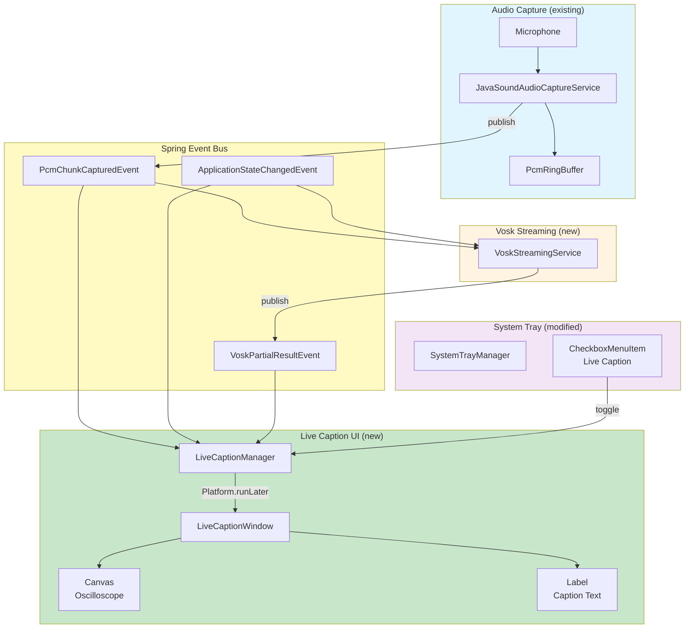
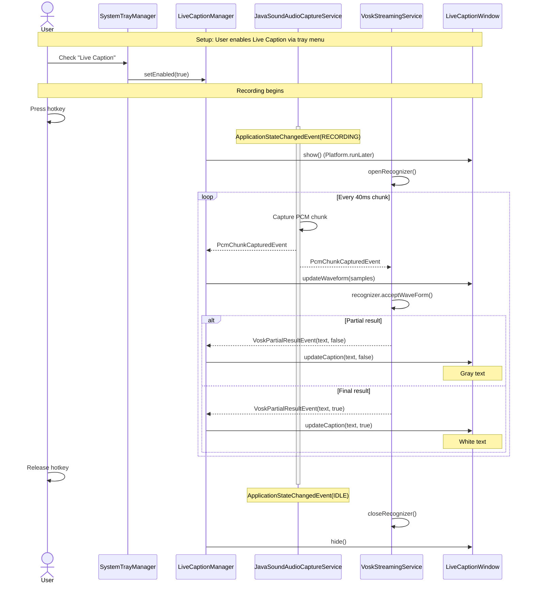
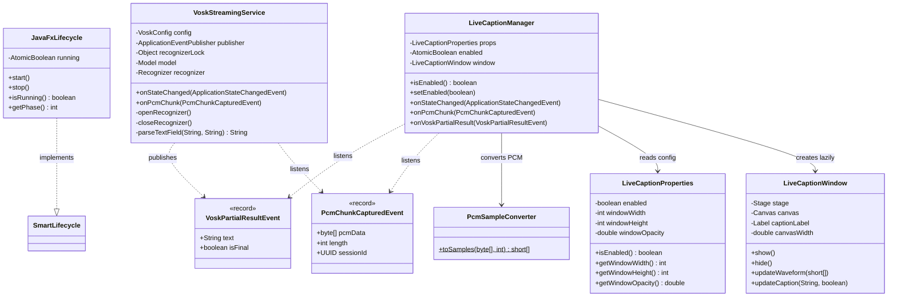
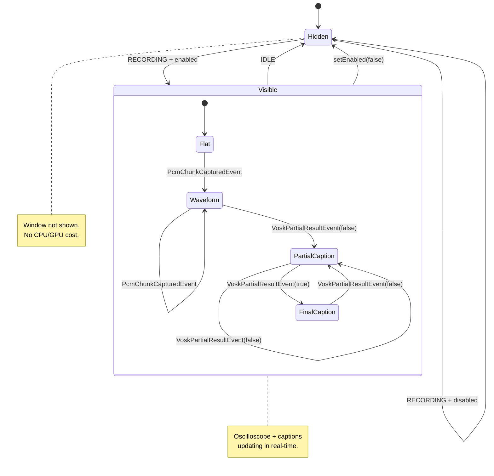
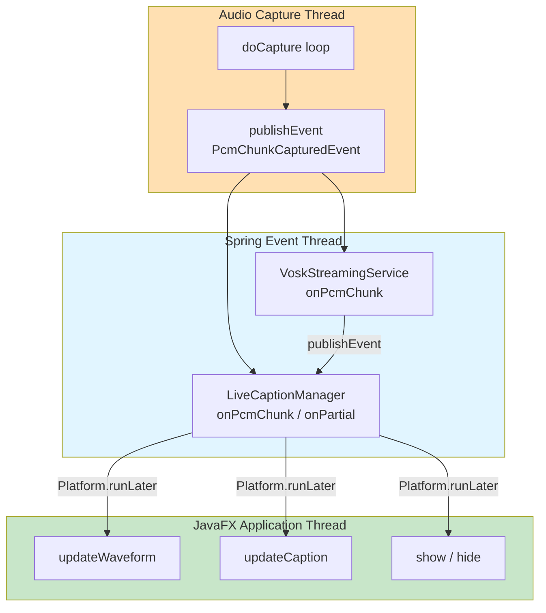
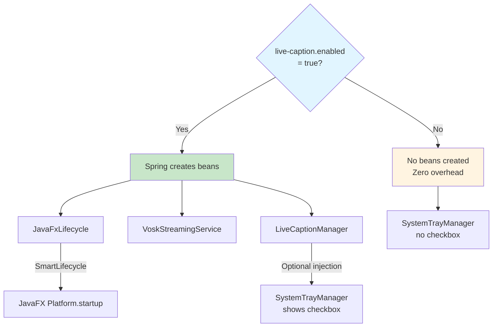
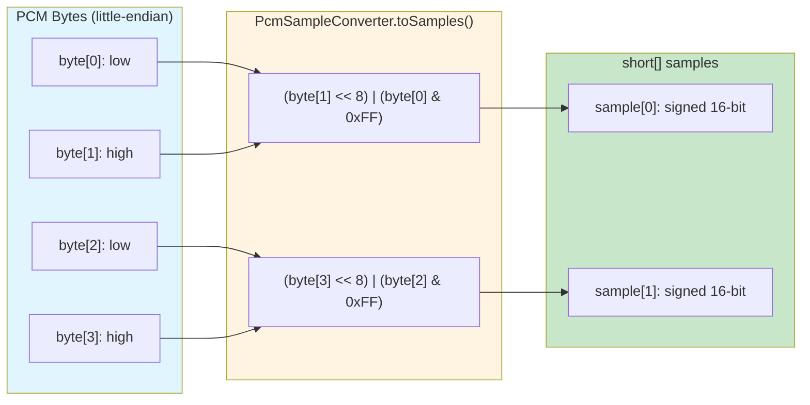

# Live Caption System

Real-time oscilloscope waveform and streaming Vosk captions displayed in a JavaFX overlay window during recording.

## Architecture Overview



## Event Flow Sequence



## Component Data Flow

```mermaid
flowchart LR
    subgraph Input["Audio Input"]
        Mic[Microphone<br/>16kHz PCM]
    end

    subgraph Capture["Capture Service"]
        Buf[byte[] buf]
        Copy[Defensive copy<br/>new byte[n]]
    end

    subgraph EventBus["Spring Events"]
        PCM[PcmChunkCapturedEvent<br/>byte[] pcmData<br/>int length<br/>UUID sessionId]
    end

    subgraph WaveformPath["Waveform Path"]
        Conv[PcmSampleConverter<br/>toSamples]
        Samples[short[] samples]
    end

    subgraph CaptionPath["Caption Path"]
        Vosk[VoskStreamingService<br/>acceptWaveForm]
        Partial[VoskPartialResultEvent<br/>String text<br/>boolean isFinal]
    end

    subgraph Display["JavaFX Window"]
        Canvas[Canvas<br/>Oscilloscope line]
        Label[Label<br/>Caption text]
    end

    Mic --> Buf
    Buf --> Copy
    Copy --> PCM

    PCM --> Conv
    Conv --> Samples
    Samples -->|Platform.runLater| Canvas

    PCM --> Vosk
    Vosk --> Partial
    Partial -->|Platform.runLater| Label

    style Input fill:#e1f5ff
    style Capture fill:#fff4e1
    style EventBus fill:#fff9c4
    style WaveformPath fill:#c8e6c9
    style CaptionPath fill:#c8e6c9
    style Display fill:#f3e5f5
```

## Class Diagram



## State Machine: Live Caption Visibility



## Thread Model



## Feature Toggle: Conditional Bean Loading



## PCM Sample Conversion



## Window Layout

```
+------------------------------------------+
|  Live Caption Window (600x250)           |
|  ┌──────────────────────────────────┐    |
|  │  Canvas (580x100)                │    |
|  │                                  │    |
|  │  ~~~~~/\~~~~~/\~~/\~~~~~~        │    |
|  │  ─────────────────────── midline │    |
|  │  ~~~~~\/~~~~~\/~~\/~~~~~~        │    |
|  │                                  │    |
|  └──────────────────────────────────┘    |
|                                          |
|  "the quick brown fox jumps over the..." |
|  (white = final, gray = partial)         |
|                                          |
+------------------------------------------+
  ↑ Positioned bottom-center of screen
  ↑ Always-on-top, transparent background
  ↑ Rounded corners, 85% opacity
```
