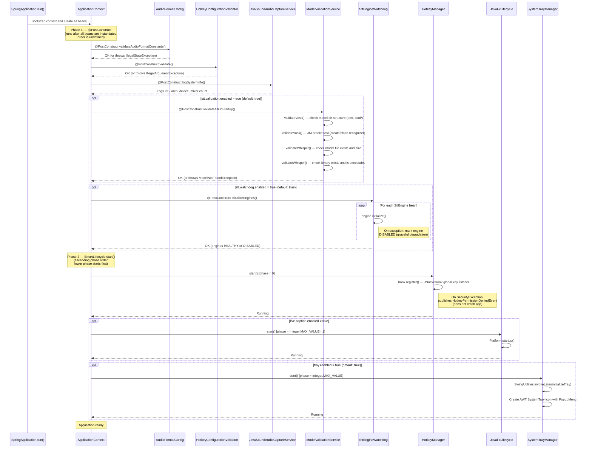
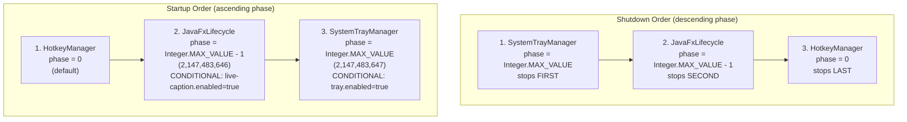
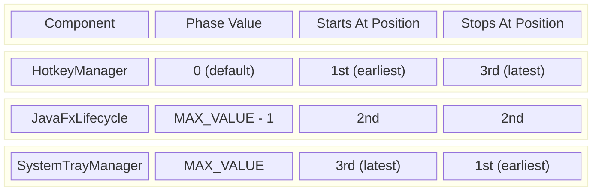
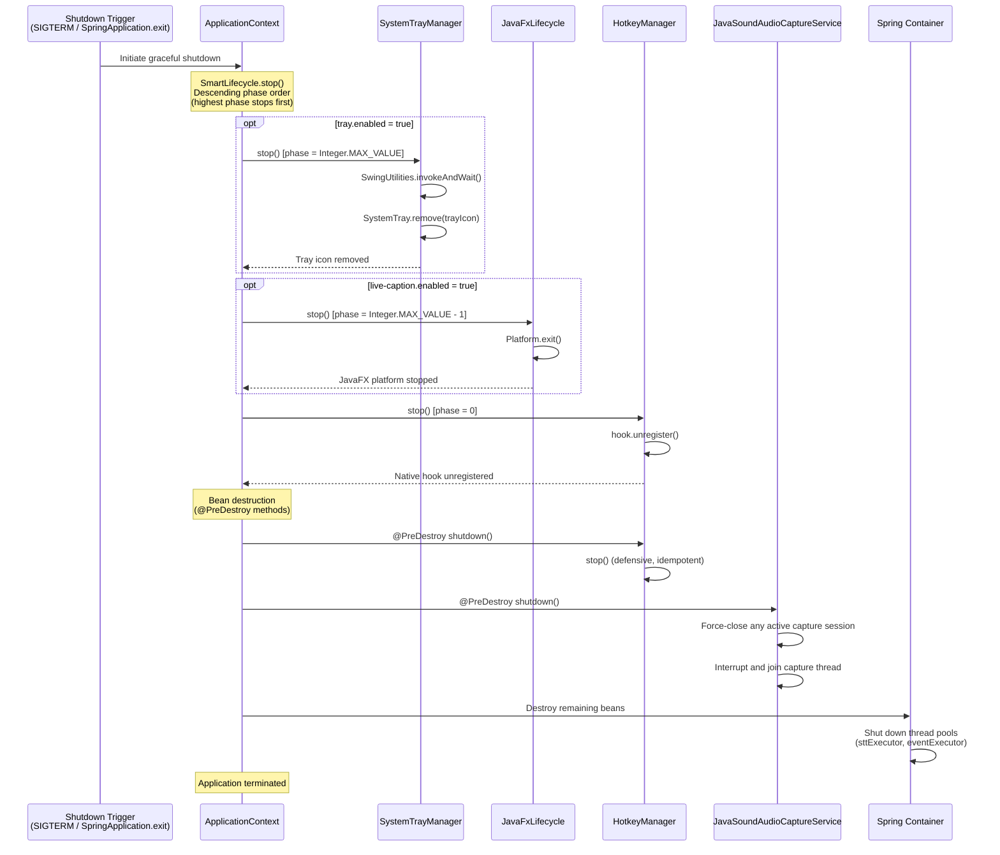
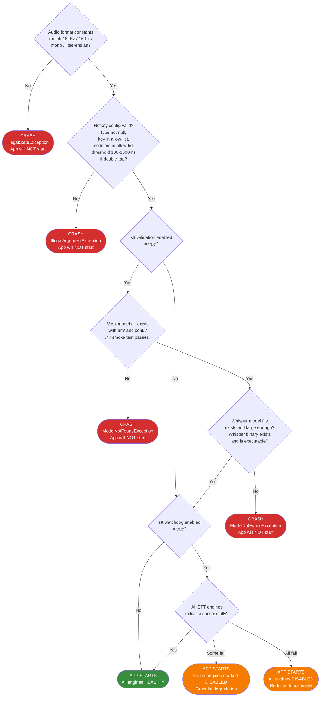

# Blckvox Startup and Shutdown Lifecycle

This document describes the complete startup and shutdown lifecycle of the blckvox Spring Boot application. It covers bean creation, `@PostConstruct` validation, `SmartLifecycle` phase ordering, and graceful shutdown teardown. All diagrams use Mermaid syntax and are derived directly from source code.

Key source files:

| Component | Source |
|---|---|
| `AudioFormatConfig` | `config/AudioFormatConfig.java` |
| `HotkeyConfigurationValidator` | `config/hotkey/HotkeyConfigurationValidator.java` |
| `JavaSoundAudioCaptureService` | `service/audio/capture/JavaSoundAudioCaptureService.java` |
| `ModelValidationService` | `config/stt/ModelValidationService.java` |
| `SttEngineWatchdog` | `service/stt/watchdog/SttEngineWatchdog.java` |
| `HotkeyManager` | `service/hotkey/HotkeyManager.java` |
| `JavaFxLifecycle` | `service/livecaption/JavaFxLifecycle.java` |
| `SystemTrayManager` | `service/tray/SystemTrayManager.java` |

---

## 1. Full Startup Sequence

This sequence diagram shows the complete startup order from `SpringApplication.run()` through `@PostConstruct` validations to `SmartLifecycle.start()` calls. Conditional beans are marked with `opt` fragments.



---

## 2. Startup Validation Chain

This flowchart shows each validation step as a decision diamond with pass/fail paths. Fail-fast validations crash the application. Graceful validations log warnings and continue.

```mermaid
flowchart TD
    START([SpringApplication.run]) --> BEANS[Create all beans]

    BEANS --> AF{AudioFormatConfig<br/>validateAudioFormatConstants<br/>16kHz, 16-bit, mono, LE?}
    AF -- Pass --> HK
    AF -- Fail --> AF_FAIL[/IllegalStateException/<br/>App exits immediately]

    HK{HotkeyConfigurationValidator<br/>validate<br/>type, key, modifiers, threshold?}
    HK -- Pass --> JSACS
    HK -- Fail --> HK_FAIL[/IllegalArgumentException/<br/>App exits immediately]

    JSACS[JavaSoundAudioCaptureService<br/>logSystemInfo<br/>Logs OS, arch, device info]
    JSACS --> MVS_CHECK

    MVS_CHECK{stt.validation.enabled<br/>= true?}
    MVS_CHECK -- "No (disabled)" --> SEW_CHECK
    MVS_CHECK -- "Yes (default)" --> VOSK

    VOSK{ModelValidationService<br/>validateVosk<br/>Model dir has am/ and conf/?<br/>JNI smoke test passes?}
    VOSK -- Pass --> WHISPER
    VOSK -- Fail --> VOSK_FAIL[/ModelNotFoundException/<br/>App exits immediately]

    WHISPER{ModelValidationService<br/>validateWhisper<br/>Model file exists and sized OK?<br/>Binary exists and executable?}
    WHISPER -- Pass --> SEW_CHECK
    WHISPER -- Fail --> WHISPER_FAIL[/ModelNotFoundException/<br/>App exits immediately]

    SEW_CHECK{stt.watchdog.enabled<br/>= true?}
    SEW_CHECK -- "No (disabled)" --> LIFECYCLE
    SEW_CHECK -- "Yes (default)" --> SEW

    SEW[SttEngineWatchdog<br/>initializeEngines]
    SEW --> SEW_LOOP

    SEW_LOOP{engine.initialize<br/>succeeds?}
    SEW_LOOP -- "Yes" --> SEW_OK[Engine marked HEALTHY]
    SEW_LOOP -- "No (exception)" --> SEW_DEGRADE[Engine marked DISABLED<br/>Log error, continue]

    SEW_OK --> LIFECYCLE
    SEW_DEGRADE --> LIFECYCLE

    LIFECYCLE([Proceed to SmartLifecycle.start])

    style AF_FAIL fill:#d32f2f,color:#fff
    style HK_FAIL fill:#d32f2f,color:#fff
    style VOSK_FAIL fill:#d32f2f,color:#fff
    style WHISPER_FAIL fill:#d32f2f,color:#fff
    style SEW_DEGRADE fill:#f57c00,color:#fff
    style SEW_OK fill:#388e3c,color:#fff
    style LIFECYCLE fill:#1565c0,color:#fff
```

---

## 3. SmartLifecycle Phase Ordering

Spring SmartLifecycle starts components in ascending phase order (lower phase value starts first) and stops them in descending phase order (higher phase value stops first). This diagram shows the phase values and resulting execution order.





The ordering ensures:
- **Startup**: The global hotkey listener registers first (phase 0). Then JavaFX platform initializes (phase MAX_VALUE - 1). Finally, the system tray icon is created (phase MAX_VALUE), which may reference the JavaFX-backed live caption manager.
- **Shutdown**: The reverse order ensures the tray icon is removed first, then JavaFX exits, and finally the native key hook is unregistered.

---

## 4. Shutdown Sequence

This sequence diagram shows the reverse teardown order. SmartLifecycle components stop in descending phase order (highest phase stops first). Then Spring destroys beans, invoking `@PreDestroy` methods.



---

## 5. Fail-Fast Decision Tree

This flowchart answers the question: "Will the application start?" It traces each validation outcome to determine whether the app boots successfully, exits immediately, or starts in a degraded state.



### Summary of Fail-Fast vs Graceful Behavior

| Validation | Behavior on Failure | Exception Type |
|---|---|---|
| `AudioFormatConfig.validateAudioFormatConstants()` | **Fail-fast** -- app will not start | `IllegalStateException` |
| `HotkeyConfigurationValidator.validate()` | **Fail-fast** -- app will not start | `IllegalArgumentException` |
| `ModelValidationService.validateVosk()` | **Fail-fast** -- app will not start | `ModelNotFoundException` |
| `ModelValidationService.validateWhisper()` | **Fail-fast** -- app will not start | `ModelNotFoundException` |
| `SttEngineWatchdog.initializeEngines()` | **Graceful** -- engine marked `DISABLED`, app continues | Exception caught and logged |
| `HotkeyManager.start()` | **Graceful** -- publishes `HotkeyPermissionDeniedEvent`, app continues | `SecurityException` caught |
