# Thread Model and Concurrency

## Thread Pool Architecture

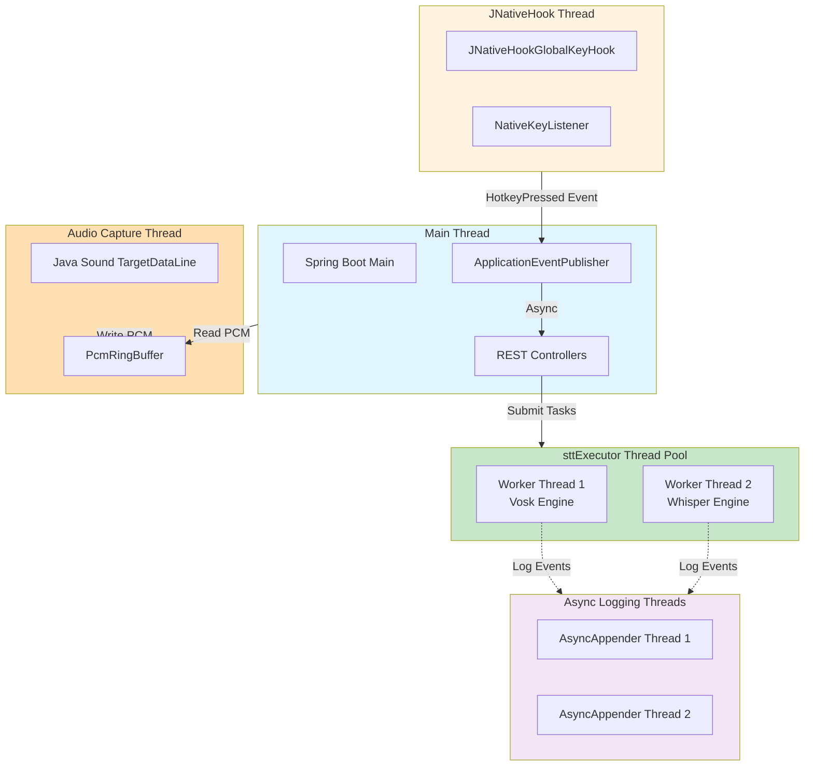

## Parallel STT Execution Flow

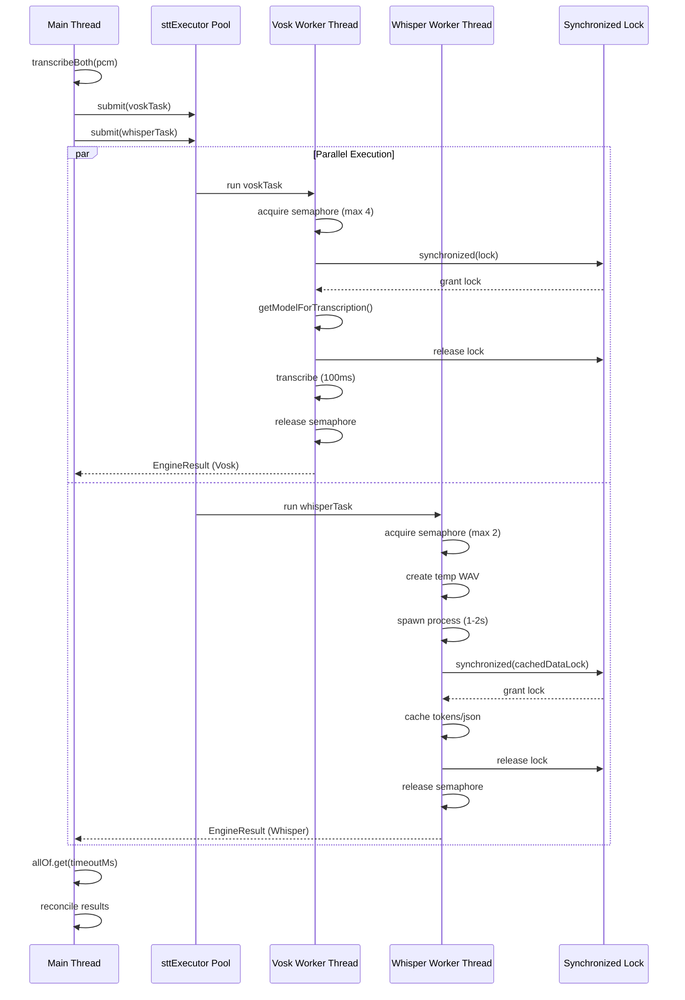

## MDC Propagation Across Threads

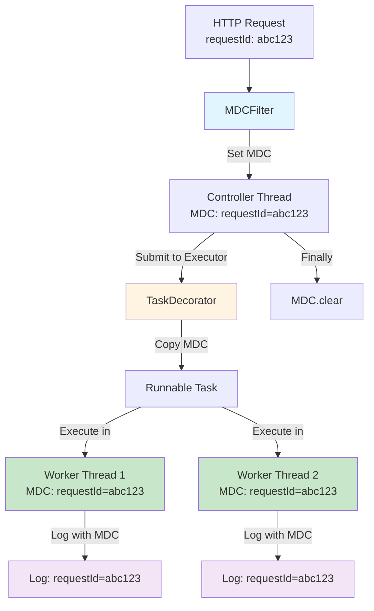

## Synchronization Points

### 1. VoskSttEngine Thread Safety

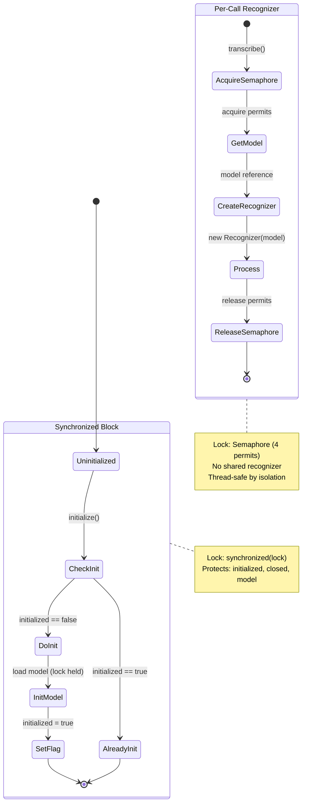

### 2. WhisperSttEngine Thread Safety

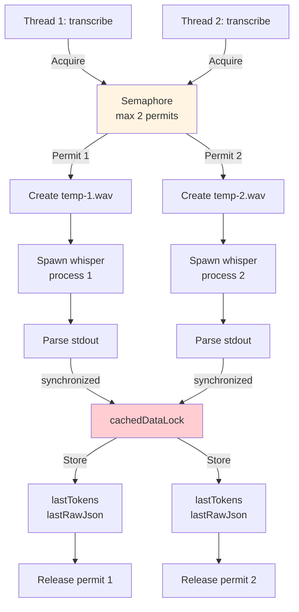

### 3. CaptureStateMachine Thread Safety

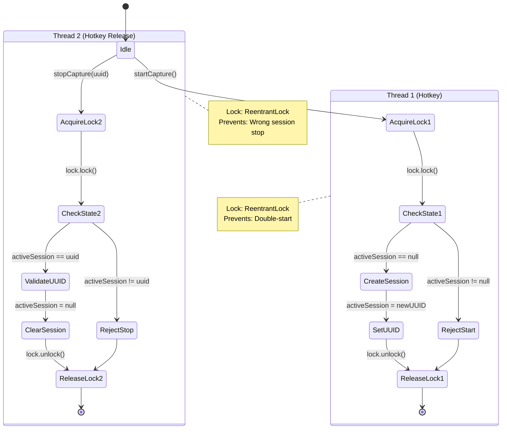

### 4. PcmRingBuffer Thread Safety

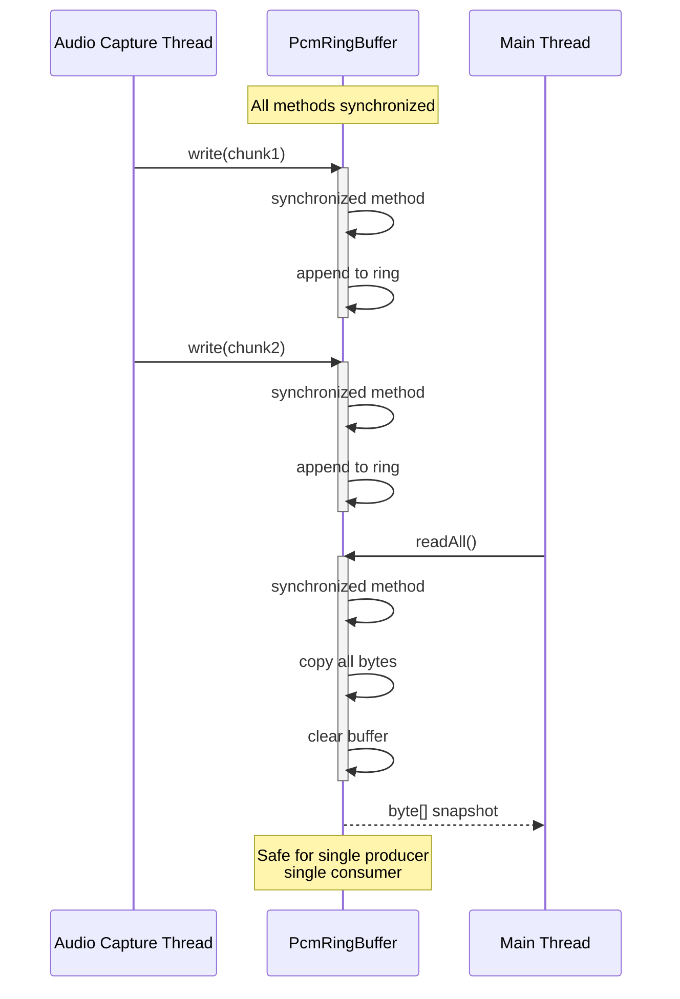

## Concurrency Control Mechanisms

### ConcurrencyGuard Pattern

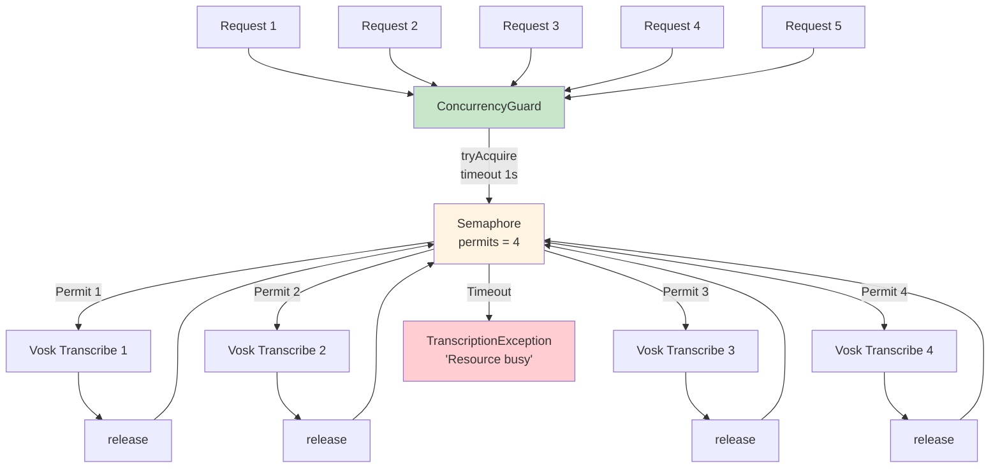

## Thread Pool Configuration

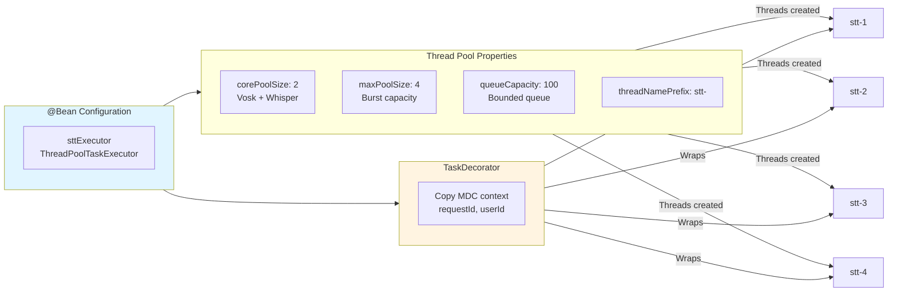

## Race Condition Prevention

### Critical Section: Engine Initialization

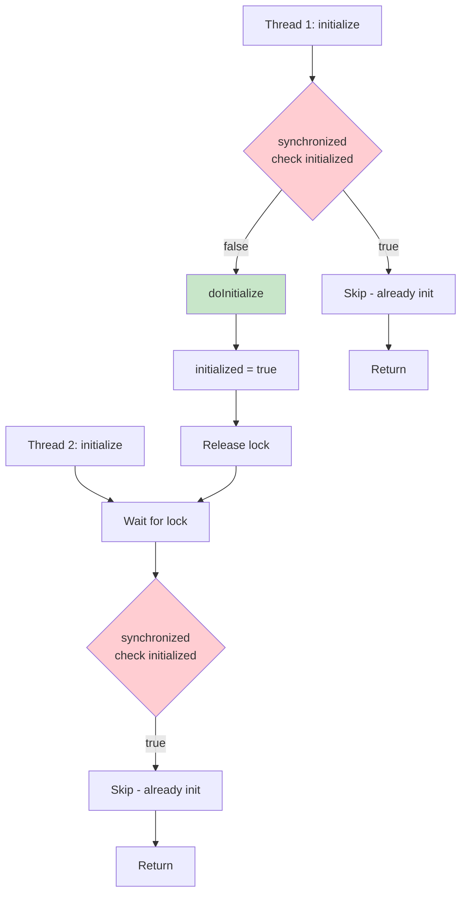

### Critical Section: Session Management

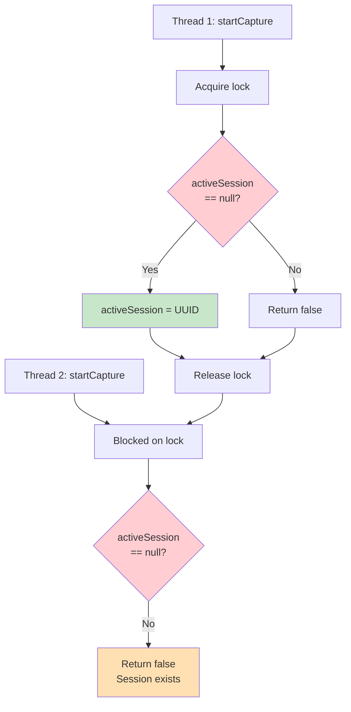

## Deadlock Prevention Strategy

### Lock Ordering Hierarchy

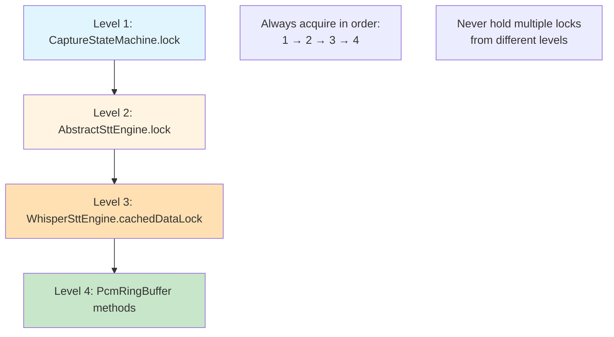

### Lock-Free Zones (Stateless Operations)

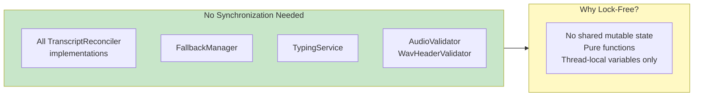

## Timeout Management

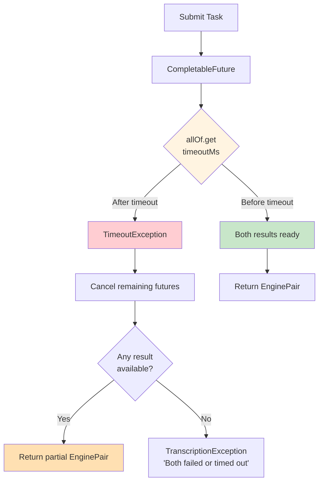

## Memory Visibility Guarantees

| Mechanism | Usage | Visibility Guarantee |
|-----------|-------|---------------------|
| `synchronized` | AbstractSttEngine, CaptureStateMachine | Happens-before relationship established |
| `volatile` | Not used (locks sufficient) | N/A |
| `final` fields | All immutable records, AbstractSttEngine.lock | Safe publication guaranteed |
| `CopyOnWriteArrayList` | HotkeyManager.listeners | Atomic snapshot reads |
| `CompletableFuture` | ParallelSttService | Result visibility via ForkJoinPool |
| `Semaphore` | ConcurrencyGuard | Memory barrier on acquire/release |

## Async Logging Thread Isolation

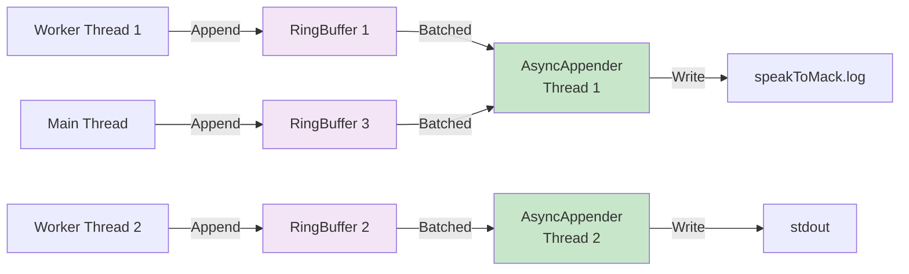

## Key Concurrency Invariants

1. **Single Active Session**: `CaptureStateMachine` ensures only one audio session active at a time
2. **Bounded Parallelism**: Semaphores limit concurrent STT operations (Vosk: 4, Whisper: 2)
3. **Per-Call Isolation**: Each transcription uses isolated resources (recognizer, temp files)
4. **Lock Ordering**: Strict hierarchy prevents deadlocks
5. **MDC Propagation**: Request context preserved across thread boundaries
6. **Idempotent Initialization**: Multiple `initialize()` calls are safe (synchronized check)
7. **Graceful Timeout**: Partial results returned if one engine completes before timeout
