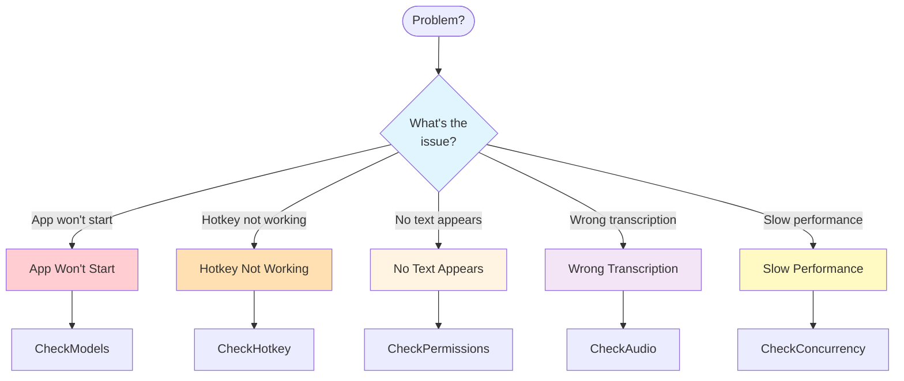
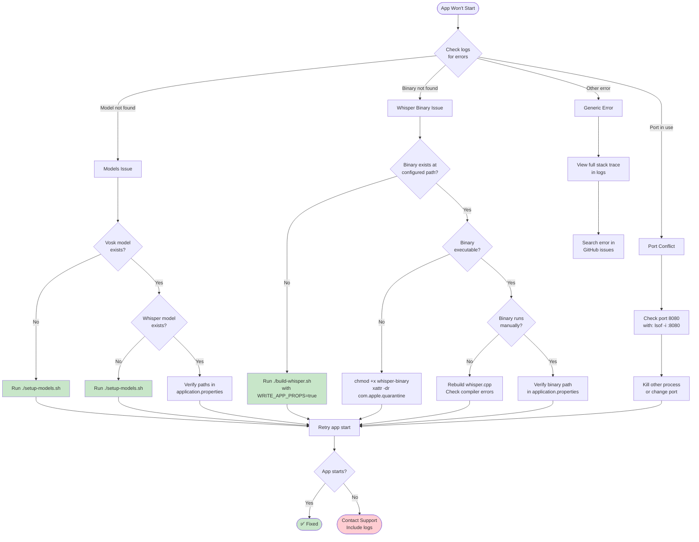
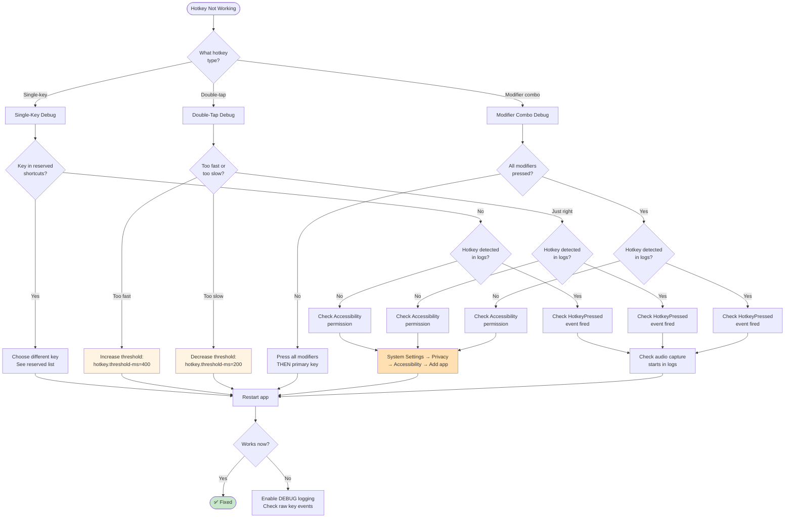
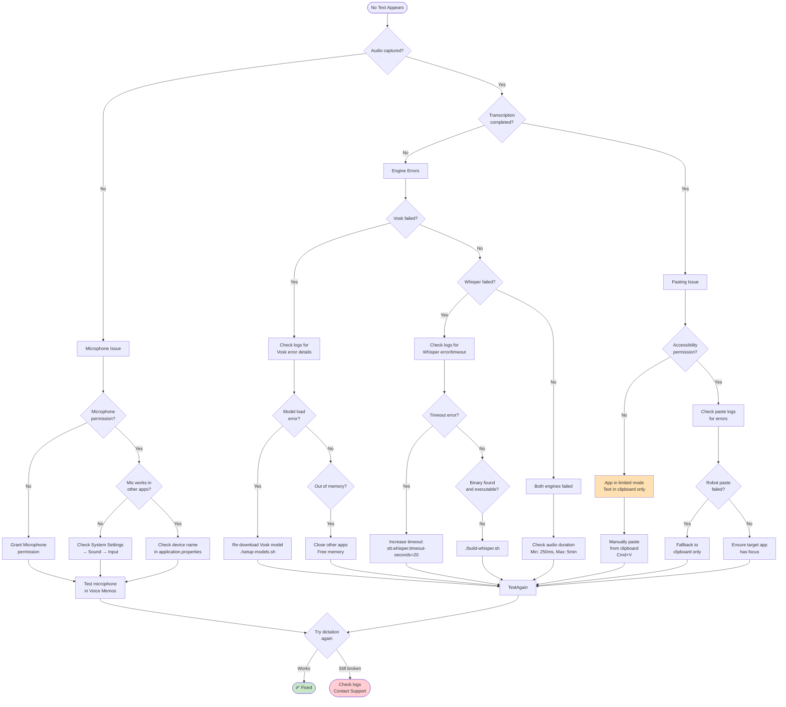
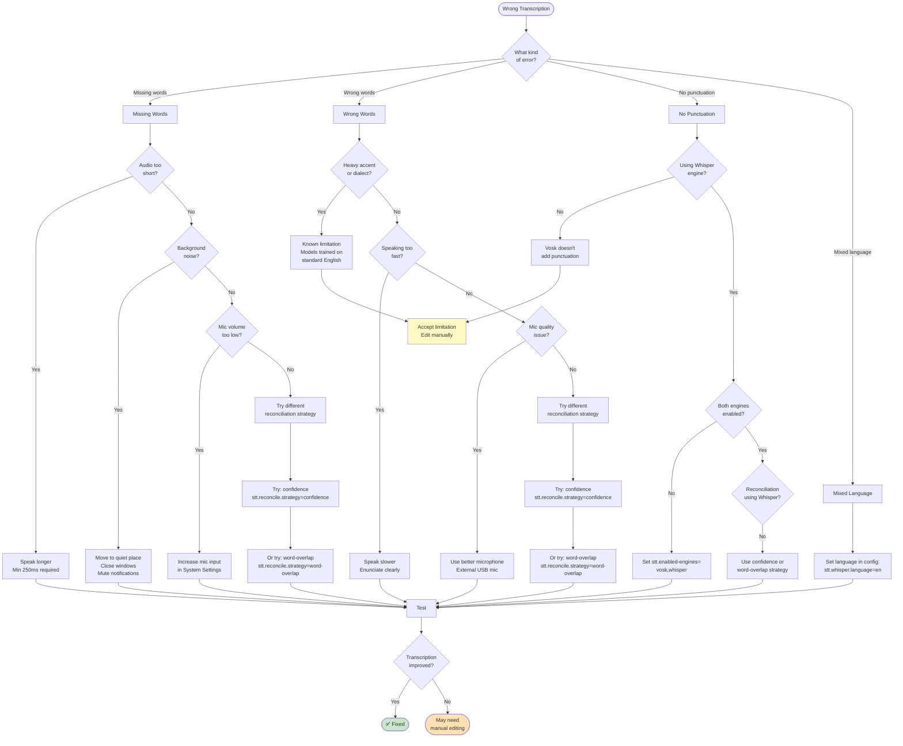
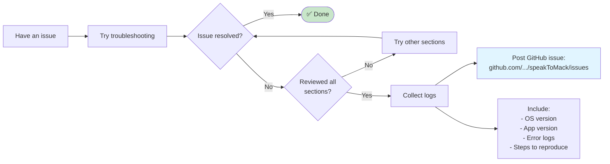

# Troubleshooting Flowchart

## Master Troubleshooting Decision Tree



## Problem 1: App Won't Start



## Problem 2: Hotkey Not Working



## Problem 3: No Text Appears



## Problem 4: Wrong Transcription



## Problem 5: Slow Performance

```mermaid
flowchart TD
    Start([Slow Performance]) --> Measure{How slow?}

    Measure -->|5+ seconds| VerySlow[Very Slow]
    Measure -->|2-5 seconds| MedSlow[Medium Slow]
    Measure -->|<2 seconds| Normal[Normal - Expected]

    VerySlow --> WhisperTimeout{Whisper<br/>timing out?}
    WhisperTimeout -->|Yes| LongAudio{Audio >30s?}
    LongAudio -->|Yes| ShorterClips[Speak in shorter clips<br/>Max recommended: 30s]
    LongAudio -->|No| IncTO[Increase timeout:<br/>stt.whisper.timeout-seconds=20]
    WhisperTimeout -->|No| BothRun{Both engines<br/>running?}

    MedSlow --> BothRun

    BothRun -->|Yes| Conditional{Conditional mode<br/>enabled?}
    Conditional -->|No| EnableCond[Enable conditional:<br/>stt.reconcile.enabled=true<br/>stt.reconcile.vosk-threshold=0.7]
    Conditional -->|Yes| Threshold{Threshold<br/>too low?}
    Threshold -->|<0.6| RaiseThresh[Raise threshold:<br/>stt.reconcile.vosk-threshold=0.8<br/>More Vosk-only, less Whisper]
    Threshold -->|0.6-0.9| CheckCPU[Check CPU usage]

    CheckCPU --> HighCPU{CPU >80%?}
    HighCPU -->|Yes| LimitConc[Reduce concurrency:<br/>stt.concurrency.vosk-max=2<br/>stt.concurrency.whisper-max=1]
    HighCPU -->|No| CheckMem[Check memory usage]

    CheckMem --> LowMem{Memory low?}
    LowMem -->|Yes| CloseApps[Close other apps<br/>Free RAM]
    LowMem -->|No| DiskCheck[Check disk I/O<br/>Activity Monitor]

    Normal --> Explain[Dual-engine transcription<br/>is compute-intensive:<br/>Vosk: 100ms<br/>Whisper: 1-2s<br/>Total: max(both) + overhead]

    ShorterClips --> Retry
    IncTO --> Retry
    EnableCond --> Retry
    RaiseThresh --> Retry
    LimitConc --> Retry
    CloseApps --> Retry
    DiskCheck --> Retry

    Retry{Performance<br/>improved?}
    Retry -->|Yes| Fixed([✅ Fixed])
    Retry -->|No| Hardware([Consider hardware<br/>upgrade or reduce<br/>model size])

    Explain --> Expected([This is expected<br/>behavior])

    style Fixed fill:#c8e6c9
    style Expected fill:#c8e6c9
    style Hardware fill:#ffe0b2
```

## Quick Reference: Common Fixes

| Symptom | Most Likely Cause | Quick Fix |
|---------|-------------------|-----------|
| App won't start | Models not downloaded | `./setup-models.sh` |
| "Binary not found" error | Whisper not built | `WRITE_APP_PROPS=true ./build-whisper.sh` |
| Hotkey not responding | Accessibility permission | System Settings → Privacy → Accessibility |
| Double-tap too sensitive | Threshold too low | `hotkey.threshold-ms=400` |
| No audio captured | Microphone permission | Grant permission when prompted |
| No text pasted | Accessibility permission | Grant permission, restart app |
| Wrong transcription | Background noise | Move to quiet environment |
| Missing punctuation | Vosk-only mode | Enable Whisper: `stt.enabled-engines=vosk,whisper` |
| 5+ second transcription | Both engines always run | `stt.reconcile.enabled=true` |
| Whisper timeout | Long audio or slow CPU | `stt.whisper.timeout-seconds=20` |

## Diagnostic Commands

### Check System State

```bash
# Verify models exist
ls -lh models/vosk-model-en-us-0.22
ls -lh models/ggml-base.en.bin

# Verify whisper binary
ls -lh tools/whisper.cpp/main
file tools/whisper.cpp/main  # Should show "Mach-O executable"

# Check binary permissions
xattr tools/whisper.cpp/main  # Should be empty (no quarantine)

# Test whisper binary manually
tools/whisper.cpp/main -m models/ggml-base.en.bin -f test-audio.wav

# Check port availability
lsof -i :8080

# Monitor app logs in real-time
tail -f logs/speakToMack.log | grep -E "(ERROR|WARN|Vosk|Whisper|Hotkey)"

# Check system microphone
system_profiler SPAudioDataType | grep -A 10 "Input"
```

### Enable Debug Logging

Add to `application.properties`:

```properties
logging.level.com.phillippitts.speaktomack=DEBUG
logging.level.com.phillippitts.speaktomack.service.hotkey=TRACE
```

## When to Seek Help



## Preventive Maintenance Checklist

- [ ] Models in correct locations (`models/` directory)
- [ ] Whisper binary built and executable
- [ ] Accessibility permission granted
- [ ] Microphone permission granted
- [ ] Application.properties paths are absolute
- [ ] Reserved shortcuts list reviewed
- [ ] Hotkey threshold tuned to your speed
- [ ] Reconciliation strategy chosen
- [ ] Logs directory writable
- [ ] Sufficient disk space (>500MB free)
- [ ] Sufficient RAM (>2GB free during transcription)
