# User Journey Map

## First-Time User Onboarding Journey


## End-to-End User Flow Timeline

```mermaid
gantt
    title Complete User Journey: Installation to Production Use
    dateFormat X
    axisFormat %M min

    section Installation
    Download JAR                    :0, 2min
    Download Vosk model (1.8 GB)    :2min, 10min
    Download Whisper model (147 MB) :2min, 3min
    Build whisper.cpp binary        :5min, 5min

    section Configuration
    Edit application.properties     :10min, 5min
    Choose hotkey settings          :15min, 2min

    section Permissions
    First launch                    :17min, 1min
    Microphone permission dialog    :18min, 30s
    Accessibility permission dialog :milestone, 18.5min, 0
    Navigate to System Settings     :18.5min, 1min
    Grant both permissions          :19.5min, 1min
    Restart app                     :20.5min, 30s

    section Testing
    Test hotkey detection           :21min, 1min
    First transcription attempt     :22min, 30s
    Verify text output              :22.5min, 30s

    section Production Use
    Daily use begins                :milestone, 23min, 0
```

## Decision Tree: Choosing Your Hotkey Type

```mermaid
flowchart TD
    Start([Choose Hotkey Type]) --> Q1{Need simple<br/>single-key?}

    Q1 -->|Yes| Q2{Key rarely used<br/>for other tasks?}
    Q1 -->|No| Q3{Comfortable with<br/>modifier combos?}

    Q2 -->|Yes| Single[✅ Single-Key Trigger<br/>e.g., F13, Right Command<br/><br/>Pros: Simple, fast<br/>Cons: May conflict]
    Q2 -->|No| DoubleTap[✅ Double-Tap Trigger<br/>e.g., Right Command 2x<br/><br/>Pros: No conflicts<br/>Cons: Slower, threshold tuning]

    Q3 -->|Yes| Combo[✅ Modifier Combination<br/>e.g., Cmd+Shift+D<br/><br/>Pros: No conflicts, familiar<br/>Cons: Two-handed operation]
    Q3 -->|No| DoubleTap

    Single --> Reserved{Key in reserved<br/>shortcuts list?}
    Reserved -->|Yes| Warning[⚠️ Warning at startup<br/>Choose different key]
    Reserved -->|No| Config1[Configure in<br/>application.properties]

    DoubleTap --> Threshold{Adjust threshold?<br/>Default: 300ms}
    Threshold -->|Too slow| Increase[Increase to 400-500ms]
    Threshold -->|Too sensitive| Decrease[Decrease to 200-250ms]
    Threshold -->|Good| Config2[Configure in<br/>application.properties]

    Combo --> Config3[Configure modifiers<br/>and primary key]

    Warning --> Start
    Increase --> Config2
    Decrease --> Config2

    Config1 --> Done([Start using app])
    Config2 --> Done
    Config3 --> Done

    style Single fill:#c8e6c9
    style DoubleTap fill:#fff4e1
    style Combo fill:#e1f5ff
    style Warning fill:#ffcdd2
```



## Typical Daily Usage Flow


## User Experience Maturity Curve


## Common User Scenarios

### Scenario 1: Writing Email


### Scenario 2: Coding with Dictation


### Scenario 3: Note-Taking in Meeting


## Permission Setup Visual Guide

```mermaid
flowchart TB
    Start([First App Launch]) --> Mic[macOS Microphone<br/>Permission Dialog]

    Mic --> Allow1{Grant Access?}
    Allow1 -->|Yes| MicGranted[✅ Microphone Enabled]
    Allow1 -->|No| MicDenied[❌ Cannot capture audio<br/>App partially functional]

    MicGranted --> AccPrompt[Accessibility<br/>Permission Needed]
    MicDenied --> AccPrompt

    AccPrompt --> Manual[Manual Setup Required:<br/>System Settings → Privacy & Security]

    Manual --> AccSettings[Navigate to<br/>Accessibility section]
    AccSettings --> AddApp[Add speakToMack.jar<br/>or terminal app]
    AddApp --> AccGranted[✅ Accessibility Enabled]

    AccGranted --> FullFunc[✅ Full Functionality<br/>Text pasting works]

    MicDenied --> Limited1[⚠️ Limited Mode<br/>Clipboard only]
    AccPrompt -->|Skip| Limited2[⚠️ Limited Mode<br/>Clipboard only]

    style MicGranted fill:#c8e6c9
    style AccGranted fill:#c8e6c9
    style FullFunc fill:#c8e6c9
    style MicDenied fill:#ffcdd2
    style Limited1 fill:#ffe0b2
    style Limited2 fill:#ffe0b2
```



## User Mental Model: How It Works


## Success Metrics: User Satisfaction Journey


## Typical Time Investment

| Activity | First Time | Subsequent | Frequency |
|----------|-----------|------------|-----------|
| **Initial setup** | 25-30 min | N/A | Once |
| **Model download** | 10-15 min | N/A | Once |
| **Permission granting** | 2-3 min | N/A | Once per macOS update |
| **Hotkey configuration** | 5-10 min | 2 min | Rare (when changing) |
| **First dictation test** | 30 sec | N/A | Once |
| **Daily dictation use** | N/A | 2-3 sec per dictation | Multiple times daily |
| **Troubleshooting** | 5-10 min | 1-2 min | Rare |

## Expected Outcomes by User Type


## User Pain Points & Solutions

| Pain Point | When It Occurs | Solution |
|------------|----------------|----------|
| Hotkey not triggering | Double-tap too slow/fast | Adjust `hotkey.threshold-ms` (200-500ms range) |
| Wrong transcription | Noisy environment | Move to quieter space, adjust mic input level |
| Text doesn't paste | Accessibility permission denied | Grant permission in System Settings |
| Slow transcription | Both engines running | Enable `stt.reconcile.enabled=true` (conditional dual-engine) |
| App won't start | Models not downloaded | Run `./setup-models.sh` |
| Whisper timeout | Complex audio processing | Increase `stt.whisper.timeout-seconds` to 15-20 |

## Emotional Journey Arc


